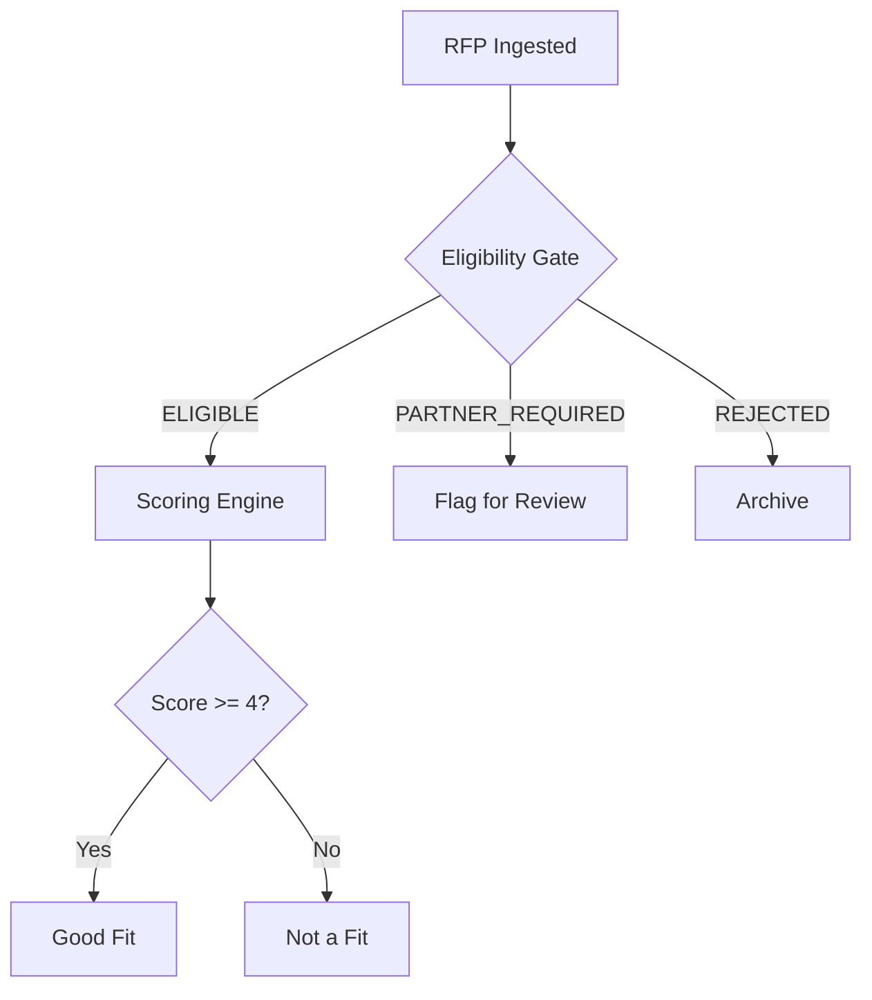
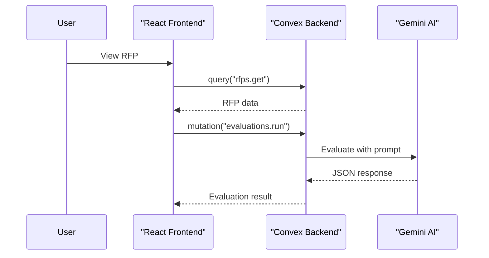
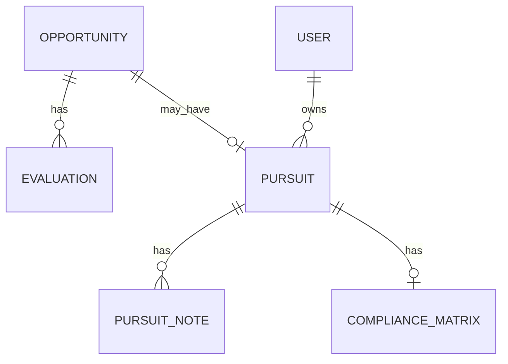

# RFP Discovery & Evaluation Platform - Project Rules

## Project Overview

**RFP Discovery** is an AI-powered RFP (Request for Proposal) discovery and evaluation platform designed to transform from a discovery tool into a "proposal machine" for Nebula Logix. The platform helps identify, qualify, and score public-sector RFP opportunities.

**Business Goal**: Establish Nebula Logix as a serious RFP bidder in the public sector (federal, state, local) with minimum one proposal submission per week.

---

## CRITICAL: Before Writing Any Code

### 1. Check the Implementation Plan FIRST

**ALWAYS** consult the implementation plan before writing code:

```
docs/implementation-plan/
├── README.md                    # Executive summary & phase overview
├── phase-1-ingestion/           # Multi-source ingestion
├── phase-2-eligibility/         # Eligibility gate (P0 priority)
├── phase-3-scoring/             # 6-dimension scoring
├── phase-4-pursuit/             # Pipeline workflow
├── phase-5-proposals/           # Templates & content library
├── phase-6-production/          # Convex, RBAC, audit
└── architecture/
    ├── README.md                # System architecture
    └── DATABASE-SCHEMA.md       # Complete Convex schema
```

| ❌ Never | ✅ Always |
|----------|-----------|
| Build features not in the plan | Check which phase the feature belongs to |
| Rebuild existing functionality | Verify what already exists first |
| Skip eligibility for scoring work | Eligibility gate runs BEFORE scoring |
| Start with Convex migrations | Build features first, persistence comes in Phase 6 |

### 2. Do NOT Redesign What Already Works

The existing UI has these top-level views that **MUST remain intact**:

- **Home View**: Processed RFPs, filters, shortlist actions, CSV export
- **Data View**: Raw API records
- **Admin View**: Tabbed interface (see below)
- **Theme Toggle**: Light/Dark mode

**All new capabilities must be ADDITIVE, not a re-platform/rewrite.**

### 3. Admin View Tab Structure

The Admin view uses a **tabbed interface** to organize settings:

| Tab | Contents |
|-----|----------|
| **Data Sources** | Source connectors (SAM.gov, RFPMart), CSV upload, Ingestion logs |
| **AI Settings** | Provider config, prompts, system instructions |
| **Evaluation** | Eligibility rules, Criteria settings |
| **Settings** | Auto-refresh interval, Provider status |

**When adding new admin features:**
- Place them in the appropriate existing tab
- Don't create new top-level sections unless absolutely necessary
- Follow the component patterns in `components/admin/*.tsx`

**Key files:**
- `components/AdminView.tsx` - Main tabbed component with tab state
- `components/admin/index.ts` - Exports all admin sub-components

### 4. Existing Admin Capabilities (Treat as "v1")

The current Admin panel already provides:

| Capability | Status | Notes |
|------------|--------|-------|
| Auto Refresh Scheduler | ✅ Exists | Configurable interval (default 24h) |
| AI Provider Selection | ✅ Exists | Gemini/OpenAI/Anthropic/Groq/DeepSeek/Ollama/LM Studio |
| AI Analysis Toggle | ✅ Exists | Fallback to keyword matching |
| Core Prompt Template | ✅ Exists | `{{TEXT_TO_ANALYZE}}` + `{{TARGET_KEYWORDS_LIST}}` |
| Per-criterion Instructions | ✅ Exists | Technical Relevance, Scope Fit, Skill Alignment |
| Evaluation Criteria | ✅ Exists | 6 criteria with enable/disable and keywords |

**We must EXTEND this, not replace it.**

---

## Tech Stack

| Layer | Technology | Purpose |
|-------|------------|---------|
| Framework | React 19.1.0 + TypeScript 5.7.2 | UI framework |
| Build | Vite 6.2.0 | Development & bundling |
| Styling | TailwindCSS | Utility-first CSS |
| Database | Convex | Real-time serverless database |
| Auth | Clerk | Authentication & user management |
| AI (Primary) | Google Gemini | RFP evaluation |
| AI (Alt) | OpenAI, Anthropic, DeepSeek, Groq | Alternative providers |
| AI (Local) | Ollama, LM Studio | Local inference |

## Directory Structure

```
rfp-discovery/
├── src/
│   ├── App.tsx                 # Main component with app state
│   ├── main.tsx                # React entry point with providers
│   ├── types.ts                # TypeScript interfaces and enums
│   ├── constants.ts            # Criteria config, defaults
│   ├── components/
│   │   ├── ui/                 # Base components (shadcn/ui style)
│   │   ├── admin/              # Admin panel components
│   │   ├── rfp/                # RFP-related components
│   │   └── common/             # Shared components
│   ├── services/               # API integrations
│   ├── hooks/                  # Custom React hooks
│   └── lib/                    # Utilities
├── convex/                     # Convex backend
│   ├── schema.ts               # Database schema
│   ├── rfps.ts                 # RFP queries/mutations
│   ├── evaluations.ts          # Evaluation functions
│   ├── pursuits.ts             # Pursuit workflow
│   └── auth.config.ts          # Clerk configuration
├── docs/
│   └── features/               # Feature planning docs
├── .claude/
│   ├── rules.md                # This file
│   └── skills/                 # Claude Code skills
└── public/                     # Static assets
```

## Code Conventions

### TypeScript Guidelines

| ❌ Avoid | ✅ Use Instead |
|----------|----------------|
| `any` type | Proper interfaces from `types.ts` |
| `as any` type coercion | Generic types or `satisfies` |
| Implicit return types | Explicit function return types |
| `type` for objects | `interface` for object shapes |
| Magic strings | Enums or const objects |

### React Patterns

| ❌ Avoid | ✅ Use Instead |
|----------|----------------|
| Class components | Functional components with hooks |
| Props drilling (3+ levels) | Context or Convex queries |
| Inline styles | Tailwind utility classes |
| Components > 300 lines | Extract to separate files |
| `useEffect` for data fetching | Convex `useQuery` |

### Convex Patterns

| ❌ Avoid | ✅ Use Instead |
|----------|----------------|
| `ctx.db.query().collect()` without limits | `.take(limit)` for pagination |
| Direct localStorage access | Convex for persistent data |
| Client-side API keys | Convex environment variables |
| Mutations without auth check | `ctx.auth.getUserIdentity()` guard |
| `Id<"table">` as string | Keep as `Id<"table">` type |

### Styling with Tailwind

| ❌ Avoid | ✅ Use Instead |
|----------|----------------|
| `bg-[#1a1a1a]`, `bg-black` | `bg-background` |
| `bg-[#262626]`, `bg-neutral-800` | `bg-card` |
| `text-white` | `text-foreground` |
| `text-gray-400`, `text-[#a3a3a3]` | `text-muted-foreground` |
| `text-blue-500`, `border-blue-500` | `text-primary`, `border-primary` |
| `text-green-500` | `text-success` |
| `text-red-500` | `text-destructive` |

## Design System

### Color Tokens (define in tailwind.config.ts)

```typescript
colors: {
  background: "hsl(var(--background))",    // Dark: #0a0a0a, Light: #ffffff
  foreground: "hsl(var(--foreground))",    // Dark: #fafafa, Light: #0a0a0a
  card: "hsl(var(--card))",                // Dark: #171717, Light: #f5f5f5
  primary: "hsl(var(--primary))",          // Blue accent: #3b82f6
  secondary: "hsl(var(--secondary))",      // Gray: #262626
  muted: "hsl(var(--muted))",
  "muted-foreground": "hsl(var(--muted-foreground))", // #a3a3a3
  destructive: "hsl(var(--destructive))",  // Red: #ef4444
  success: "hsl(var(--success))",          // Green: #22c55e
  warning: "hsl(var(--warning))",          // Yellow: #eab308
}
```

### Typography

- **Headings**: font-semibold, tracking-tight
- **Body**: font-normal, text-muted-foreground for secondary
- **Monospace**: font-mono for code/IDs

### Component Library

Use components from `src/components/ui/`:

| Component | Usage |
|-----------|-------|
| `RfpCard` | Display individual RFP in grid |
| `EvaluationBadge` | Score indicator (green/yellow/red) |
| `FilterControls` | Search, category, date filters |
| `Modal` | Details view overlay |
| `Button` | Actions with variants |
| `LoadingSpinner` | Loading states |

## Evaluation System

### 6-Dimension Scoring Framework

| Dimension | Weight | Keywords/Criteria |
|-----------|--------|-------------------|
| Technical Relevance | 25% | aws, cloud, serverless, react, api, kubernetes |
| Scope Fit | 20% | website redesign, platform modernization, cloud migration |
| Category Focus | 15% | public sector, federal, state, IT services |
| Client Profile | 15% | federal agency, state agency, technology-forward |
| Logistics | 15% | Remote feasibility, timeline ≥5 days, scope clarity |
| Skill Alignment | 10% | frontend, backend, full-stack, devops, qa |

### Eligibility Gating (Hard Disqualifiers)

| Pattern | Result |
|---------|--------|
| "USA organization only" | Reject or Needs Partner |
| "Security clearance required" | Reject |
| "On-site presence required" | Reject |
| "Must be located in [State]" | Evaluate |

### Chaseability Score Thresholds

| Score | Recommendation | Action |
|-------|---------------|--------|
| ≥70% | **Pursue** | Move to capture phase |
| 50-69% | **Maybe** | Investigate further |
| <50% | **Skip** | Archive |

### AI Response Backward Compatibility

The current AI returns:
```json
{"foundKeywords": [...], "isMatch": true/false}
```

**Extended format (optional, preferred):**
```json
{
  "foundKeywords": [...],
  "isMatch": true/false,
  "confidence": 0.85,
  "evidenceSnippets": ["...relevant excerpt..."],
  "detectedConstraints": ["USA-only", "onsite-required"]
}
```

**Compatibility Rule:**
- If AI returns only the old JSON → system still works
- If AI returns extended JSON → store and display evidence

---

## Pursuit Workflow

```
New → Triage → Bid/No-Bid Decision
                    ↓
              [Bid] → Capture → Draft → Review → Submit
                    ↓
              [No-Bid] → Archive with reason
```

| Status | Definition |
|--------|------------|
| `new` | Just ingested, unreviewed |
| `triage` | Under initial review |
| `bid` | Decision to pursue |
| `no-bid` | Decision to skip |
| `capture` | Gathering intel, building strategy |
| `draft` | Writing proposal |
| `review` | Red team / final review |
| `submitted` | Sent to client |
| `won` / `lost` | Outcome tracking |

## RFP Data Sources

| Source | Priority | API Available | Region |
|--------|----------|---------------|--------|
| SAM.gov | P1 | Yes | Federal |
| Maryland eMMA | P1 | No (scrape) | State |
| RFPMart | Current | Yes | Mixed |
| GovTribe | P2 | Yes (paid) | Federal |
| BidNet/DemandStar | P3 | Varies | State/Local |

## Environment Variables

### Required (.env.local)

```env
VITE_CONVEX_URL=https://your-project.convex.cloud
VITE_CLERK_PUBLISHABLE_KEY=pk_test_...
```

### Convex Dashboard (Server-side)

```
CLERK_ISSUER_URL=https://your-clerk-domain.clerk.accounts.dev
GEMINI_API_KEY=...
OPENAI_API_KEY=...
SAM_GOV_API_KEY=...
```

## Development Workflows

### Local Development

```bash
npm run dev          # Start Vite dev server (port 5173)
npx convex dev       # Start Convex dev server (separate terminal)
```

### Common Commands

```bash
npm run build        # Production build
npm run preview      # Preview production build
npx convex deploy    # Deploy Convex to production
npx convex dashboard # Open Convex dashboard
```

### Git Workflow

- Branch naming: `feature/`, `fix/`, `chore/`
- Commit messages: Present tense, imperative ("Add feature" not "Added feature")
- PR required for `main` branch

## Feature Planning (Required)

Before implementing any new feature, **create a planning document** in `docs/features/[feature-name]/`:

```
docs/features/[feature-name]/
├── README.md           # Concept overview and goals
├── ARCHITECTURE.md     # Technical design
└── IMPLEMENTATION.md   # Step-by-step plan
```

### README.md Template

```markdown
# Feature: [Name]

## Problem Statement
What problem does this solve?

## Proposed Solution
High-level approach.

## Success Criteria
- [ ] Criterion 1
- [ ] Criterion 2

## Out of Scope
What this feature does NOT include.
```

---

## Documentation Standards

### Mermaid Diagrams

Use Mermaid for architecture diagrams, flowcharts, and sequence diagrams.

**CRITICAL: Special Character Handling**

Mermaid breaks on special characters. **ALWAYS quote node labels containing:**
- Parentheses `()`, brackets `[]`, braces `{}`
- Colons `:`, pipes `|`, arrows `>`
- Ampersands `&`, question marks `?`
- HTML entities or any non-alphanumeric characters

| ❌ Will Break | ✅ Works |
|---------------|----------|
| `A[User (Admin)]` | `A["User (Admin)"]` |
| `B[Status: Active]` | `B["Status: Active"]` |
| `C[Q&A System]` | `C["Q&A System"]` |
| `D[/api/rfps]` | `D["/api/rfps"]` |
| `E[<5 days]` | `E["<5 days"]` |

### Mermaid Flowchart Example



### Mermaid Sequence Diagram Example



### Mermaid Entity Relationship Example



### ASCII Diagrams

For simpler inline documentation, use ASCII art:

```
┌─────────────────────────────────────────────────────────┐
│                    PROCESSING PIPELINE                   │
├─────────────────────────────────────────────────────────┤
│  INGEST → DEDUPE → ELIGIBILITY → SCORE → PIPELINE       │
└─────────────────────────────────────────────────────────┘
```

### Documentation Location

| Doc Type | Location | Purpose |
|----------|----------|---------|
| Architecture | `docs/implementation-plan/architecture/` | System design |
| Phase Plans | `docs/implementation-plan/phase-*/` | Implementation guides |
| Feature Specs | `docs/features/[feature]/` | Feature planning |
| API Docs | Inline JSDoc + `convex/*.ts` | Function documentation |

## Security Guidelines

| ❌ Never | ✅ Always |
|----------|-----------|
| Store API keys in localStorage | Use Convex environment variables |
| Make AI calls from client | Route through Convex actions |
| Trust client-side auth state | Verify `ctx.auth.getUserIdentity()` |
| Store PII in logs | Sanitize sensitive data |
| Commit `.env.local` | Add to `.gitignore` |

## Available Skills

Use these Claude Code skills when implementing features:

| Skill | Invoke When |
|-------|-------------|
| `/rfp-ingest` | Adding new RFP data sources |
| `/rfp-evaluate` | Modifying evaluation criteria or scoring |
| `/pursuit-brief` | Working on pursuit brief generation |
| `/compliance-matrix` | Building compliance tracking features |
| `/proposal-builder` | Assembling proposal templates |
| `/convex-patterns` | Writing Convex queries/mutations |
| `/clerk-auth` | Setting up authentication flows |
| `/csv-export` | Implementing data export features |

## Type Definitions Reference

Key interfaces from `types.ts`:

```typescript
interface RFP {
  id: string;
  externalId: string;
  source: RfpSource;
  title: string;
  description: string;
  location: string;
  category: string;
  postedDate: number;
  expiryDate: number;
  url: string;
}

interface Evaluation {
  rfpId: Id<"rfps">;
  score: number;
  isFit: boolean;
  criteriaResults: CriterionResult[];
  eligibility: EligibilityResult;
}

interface Pursuit {
  rfpId: Id<"rfps">;
  status: PursuitStatus;
  decision: "pursue" | "maybe" | "skip";
  brief?: PursuitBrief;
  complianceMatrix?: ComplianceMatrix;
}

type PursuitStatus =
  | "new" | "triage" | "bid" | "no-bid"
  | "capture" | "draft" | "review"
  | "submitted" | "won" | "lost";
```
