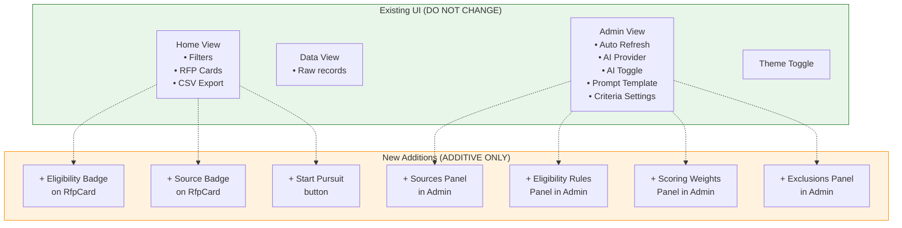
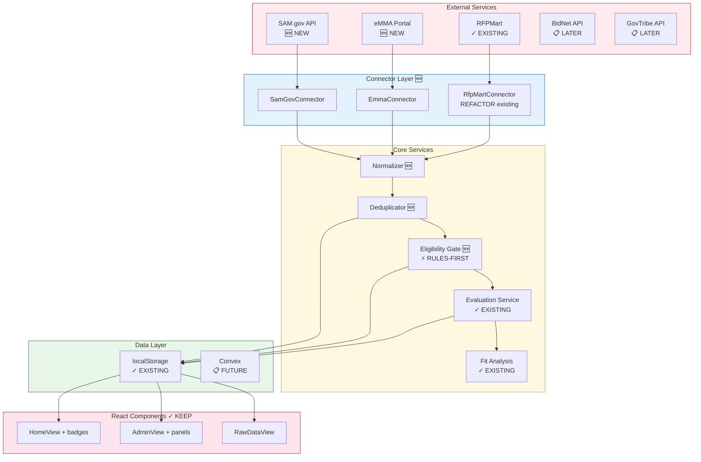
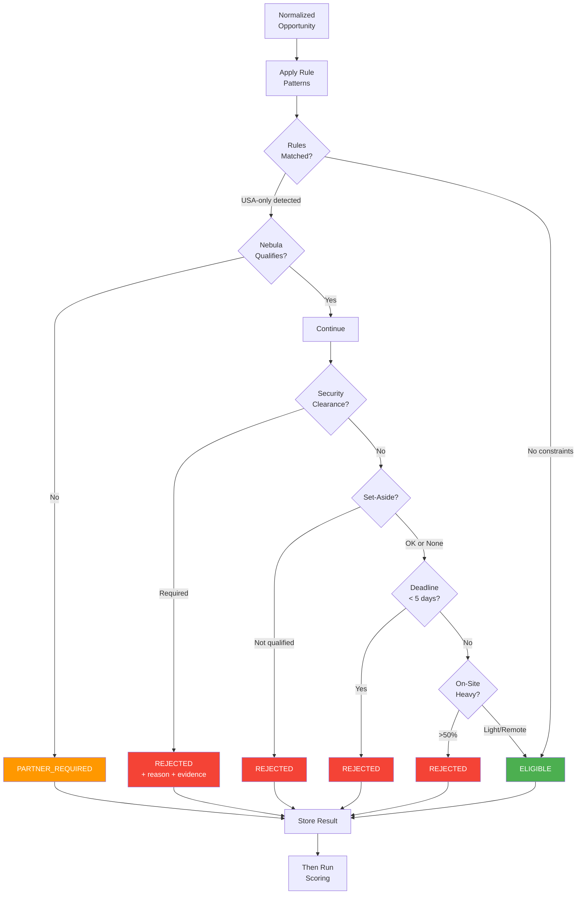

# RFP System Architecture

## ⚠️ CTO Architecture Mandate

> [!CAUTION]
> **Non-Negotiable Constraints:**
> 1. **DO NOT redesign** existing Home/Data/Admin views
> 2. All changes must be **additive enhancements**
> 3. Eligibility gating must be **rule-driven first** (AI is enhancement, not dependency)
> 4. AI JSON output must be **backward compatible**
> 5. Follow the **execution order** exactly to avoid rework

---

## Overview

This document provides the technical architecture for the Nebula Logix RFP Discovery & Pursuit System at two levels:
1. **Executive Level** - High-level system view for stakeholders
2. **Developer Level** - Detailed implementation guidance for engineers

---

# Part 1: Executive Architecture

## High-Level System Diagram

```mermaid
flowchart LR
    subgraph Sources["📥 Data Sources"]
        SAM[SAM.gov]
        EMMA[eMMA]
        RFPM[RFPMart<br/>✓ Existing]
        BIDNET[BidNet]
        GOVTRIBE[GovTribe]
    end
    
    subgraph Engine["🧠 RFP Engine"]
        INGEST[Ingestion<br/>Layer]
        GATE[Eligibility<br/>Gate<br/>⚡ RULES-FIRST]
        SCORE[Scoring<br/>Engine]
    end
    
    subgraph Workflow["📋 Pursuit System"]
        PIPE[Pipeline<br/>Manager]
        PROP[Proposal<br/>Generator]
    end
    
    subgraph Output["📤 Outputs"]
        DASH[Dashboard<br/>✓ KEEP AS-IS]
        EXPORT[CSV Export<br/>✓ KEEP AS-IS]
        AWS[AWS<br/>Marketplace]
    end
    
    Sources --> Engine
    Engine --> Workflow
    Workflow --> Output
    
    style Sources fill:#E3F2FD,stroke:#1976D2
    style Engine fill:#FFF3E0,stroke:#F57C00
    style Workflow fill:#E8F5E9,stroke:#388E3C
    style Output fill:#F3E5F5,stroke:#7B1FA2
```



### What Each Component Does

| Component              | Purpose                                  | UI Impact              |
| ---------------------- | ---------------------------------------- | ---------------------- |
| **Ingestion Layer**    | Pulls RFPs from 5+ platforms             | None (backend)         |
| **Eligibility Gate**   | Rules-first rejection of ineligible bids | Badge on RfpCard       |
| **Scoring Engine**     | Weighted 6-dimension scoring             | Existing, enhanced     |
| **Pipeline Manager**   | Track pursuits through stages            | "Start Pursuit" button |
| **Proposal Generator** | Assemble responses from templates        | Future phase           |

---

## What Exists Today (v1 Baseline — DO NOT CHANGE)

### Current Views (Keep Intact)

| View             | Purpose                                    | Changes Allowed     |
| ---------------- | ------------------------------------------ | ------------------- |
| **Home**         | Processed RFPs, filters, shortlist, export | Add badges only     |
| **Data**         | Raw API records                            | None                |
| **Admin**        | Configuration controls                     | Add new panels only |
| **Theme Toggle** | Light/Dark                                 | None                |

### Current Admin Capabilities (Extend, Don't Replace)

1. **Auto Refresh Scheduler** - Configurable interval (min 1 hour)
2. **AI Provider Selection** - Gemini/OpenAI/Anthropic/Groq/etc.
3. **AI Analysis Toggle** - Enable/disable with keyword fallback
4. **Core Prompt Template** - `{{TEXT_TO_ANALYZE}}` + `{{TARGET_KEYWORDS_LIST}}`
5. **Per-criterion System Instructions** - Tech Relevance, Scope Fit, Skill Alignment
6. **Evaluation Criteria Settings** - 6 dimensions with keyword lists

---

## UI Changes Map (Minimal Additions Only)



---

# Part 2: Developer Architecture

## Technology Stack (Unchanged)

| Layer         | Technology                                   | Purpose            |
| ------------- | -------------------------------------------- | ------------------ |
| **Frontend**  | React 19 + TypeScript + Vite                 | Dashboard UI       |
| **State**     | React hooks + localStorage → Convex (future) | Data management    |
| **API Layer** | REST connectors + FastAPI backend            | Data ingestion     |
| **AI**        | Multi-provider (Gemini, OpenAI, Anthropic)   | Scoring & analysis |
| **Database**  | Convex (planned)                             | Persistence        |
| **Auth**      | Clerk (planned)                              | User management    |

---

## System Architecture Diagram (With New Components Highlighted)



---

## Data Model (Required Entities)

### Core Entities

```typescript
/**
 * Canonical normalized record (one per unique opportunity)
 */
interface Opportunity {
  id: string;                    // Internal UUID
  title: string;
  description: string;
  buyer: BuyerInfo;
  geography: GeographyInfo;
  postedDate: Date;
  submissionDeadline: Date;
  naicsCodes: string[];
  estimatedValue?: number;
  dedupeHash: string;            // For cross-source matching
  lastUpdated: Date;
}

/**
 * Raw per-source payload, linked to Opportunity
 */
interface SourceRecord {
  id: string;
  opportunityId: string;         // FK to Opportunity
  source: RFPSource;             // SAM | EMMA | RFPMART | BIDNET | GOVTRIBE
  rawPayload: unknown;           // Original API response
  fetchedAt: Date;
}

/**
 * Eligibility + scoring results
 */
interface Evaluation {
  id: string;
  opportunityId: string;          // FK to Opportunity
  
  // Eligibility (Phase 2 — runs BEFORE scoring)
  eligibilityStatus: 'ELIGIBLE' | 'PARTNER_REQUIRED' | 'REJECTED';
  eligibilityReasons: string[];   // Machine-readable + human-readable
  evidenceSnippets: string[];     // Short excerpts that triggered rules
  
  // Scoring (6 dimensions)
  dimensionScores: {
    technicalRelevance: DimensionScore;
    scopeFit: DimensionScore;
    categoryFocus: DimensionScore;
    clientProfile: DimensionScore;
    logistics: DimensionScore;
    skillSetAlignment: DimensionScore;
  };
  
  totalScore: number;
  isGoodFit: boolean;
  
  evaluatedAt: Date;
}

/**
 * Pursuit tracking (Phase 5)
 */
interface Pursuit {
  id: string;
  opportunityId: string;
  stage: PursuitStage;
  owners: string[];
  notes: Note[];
  deadlines: {
    questionsDeadline?: Date;
    submissionDeadline: Date;
  };
  submissionMethod: string;
  outcome?: 'WON' | 'LOST' | 'CANCELLED';
  createdAt: Date;
  updatedAt: Date;
}

/**
 * Consolidated admin configuration
 */
interface AdminConfig {
  // Existing
  aiConfig: AIProviderConfig;
  evaluationCriteria: CriteriaConfig[];
  
  // New additions
  eligibilityRules: EligibilityRulesConfig;
  sourcesConfig: SourcesConfig;
  scoringWeights: ScoringWeightsConfig;
  negativeKeywords: NegativeKeywordsConfig;
}
```

### Enums

```typescript
enum RFPSource {
  SAM = 'SAM',
  EMMA = 'EMMA',
  RFPMART = 'RFPMART',
  BIDNET = 'BIDNET',
  GOVTRIBE = 'GOVTRIBE'
}

enum PursuitStage {
  NEW = 'NEW',
  TRIAGE = 'TRIAGE',
  BID_NO_BID = 'BID_NO_BID',
  CAPTURE = 'CAPTURE',
  DRAFT = 'DRAFT',
  REVIEW = 'REVIEW',
  SUBMIT = 'SUBMIT',
  OUTCOME = 'OUTCOME',
  ARCHIVED = 'ARCHIVED'
}
```

---

## Eligibility Gate Architecture (CRITICAL)

> [!CAUTION]
> **Implementation Rule:** Eligibility must be **rule-driven first**. 
> AI extraction is an optional enhancement, NOT a dependency.

### Processing Flow



### Eligibility Rules Configuration

```typescript
interface EligibilityRulesConfig {
  enabled: boolean;
  
  rules: {
    usaOrganizationOnly: {
      enabled: boolean;
      patterns: string[];          // Regex patterns
      action: 'PARTNER_REQUIRED' | 'REJECT';
    };
    securityClearance: {
      enabled: boolean;
      patterns: string[];
      action: 'REJECT';
    };
    setAsides: {
      enabled: boolean;
      qualifiedTypes: string[];    // e.g., ['SMALL_BUSINESS']
      action: 'REJECT';
    };
    minimumDeadline: {
      enabled: boolean;
      minDaysOut: number;          // Default: 5
      action: 'REJECT';
    };
    onsiteHeavy: {
      enabled: boolean;
      patterns: string[];
      action: 'REJECT';
    };
    outOfScopeIndustries: {
      enabled: boolean;
      keywords: string[];          // construction, HVAC, etc.
      action: 'REJECT';
    };
  };
}
```

### Constraint Extraction (Rule-Based)

```typescript
// services/eligibility/constraintExtractor.ts

const ELIGIBILITY_PATTERNS = {
  usaOrganizationOnly: [
    /usa\s+organization\s+only/i,
    /u\.?s\.?\s+organization\s+required/i,
    /must\s+be\s+(a\s+)?u\.?s\.?\s+company/i,
    /domestic\s+source\s+only/i,
    /onshore\s+only/i,
  ],
  
  securityClearance: [
    /security\s+clearance\s+required/i,
    /secret\s+clearance/i,
    /top\s+secret/i,
    /ts\/sci/i,
    /public\s+trust/i,
  ],
  
  setAsides: {
    '8A': [/8\(a\)/i, /8a\s+set.?aside/i],
    'SDVOSB': [/sdvosb/i, /service.?disabled\s+veteran/i],
    'HUBZONE': [/hubzone/i],
    'WOSB': [/wosb/i, /women.?owned/i],
    'SMALL_BUSINESS': [/small\s+business\s+set.?aside/i],
  },
  
  onsiteRequired: [
    /on.?site\s+required/i,
    /must\s+be\s+located\s+in/i,
    /local\s+presence\s+required/i,
    /100%?\s+on.?site/i,
    /onsite\s+5\s+days/i,
  ],
  
  outOfScope: [
    /construction/i,
    /hvac/i,
    /plumbing/i,
    /electrical\s+works/i,
    /asbestos/i,
    /roofing/i,
    /demolition/i,
  ],
};

export function extractConstraints(text: string): ExtractedConstraints {
  const results: ExtractedConstraints = {
    matched: [],
    evidenceSnippets: [],
  };
  
  for (const [category, patterns] of Object.entries(ELIGIBILITY_PATTERNS)) {
    // Handle nested patterns (like setAsides)
    if (typeof patterns === 'object' && !Array.isArray(patterns)) {
      for (const [subType, subPatterns] of Object.entries(patterns)) {
        for (const pattern of subPatterns as RegExp[]) {
          const match = text.match(pattern);
          if (match) {
            results.matched.push({ category, subType, pattern: pattern.source });
            results.evidenceSnippets.push(extractSnippet(text, match.index!, match[0].length));
          }
        }
      }
    } else {
      for (const pattern of patterns as RegExp[]) {
        const match = text.match(pattern);
        if (match) {
          results.matched.push({ category, pattern: pattern.source });
          results.evidenceSnippets.push(extractSnippet(text, match.index!, match[0].length));
        }
      }
    }
  }
  
  return results;
}

function extractSnippet(text: string, index: number, matchLength: number): string {
  const start = Math.max(0, index - 50);
  const end = Math.min(text.length, index + matchLength + 50);
  return '...' + text.slice(start, end) + '...';
}
```

---

## AI Backward Compatibility (MANDATORY)

### Current AI Response Format (v1)

```json
{
  "foundKeywords": ["React", "AWS"],
  "isMatch": true
}
```

**The system MUST continue to work with this response.**

### Extended AI Response Format (v2 — Optional)

```json
{
  "foundKeywords": ["React", "AWS"],
  "isMatch": true,
  "confidence": 0.85,
  "evidenceSnippets": ["...requires experience in React and AWS Lambda..."],
  "detectedConstraints": ["USA-only", "onsite-required"]
}
```

### Implementation Pattern

```typescript
// services/ai/responseParser.ts

interface AIResponseV1 {
  foundKeywords: string[];
  isMatch: boolean;
}

interface AIResponseV2 extends AIResponseV1 {
  confidence?: number;
  evidenceSnippets?: string[];
  detectedConstraints?: string[];
}

export function parseAIResponse(response: unknown): AIResponseV2 {
  const parsed = response as AIResponseV2;
  
  // Validate v1 fields (required)
  if (!Array.isArray(parsed.foundKeywords) || typeof parsed.isMatch !== 'boolean') {
    throw new Error('Invalid AI response: missing required fields');
  }
  
  // v2 fields are optional — provide defaults
  return {
    foundKeywords: parsed.foundKeywords,
    isMatch: parsed.isMatch,
    confidence: parsed.confidence ?? (parsed.isMatch ? 1 : 0),
    evidenceSnippets: parsed.evidenceSnippets ?? [],
    detectedConstraints: parsed.detectedConstraints ?? [],
  };
}
```

---

## Admin Panel Additions (Layout)

### Current Admin (Keep As-Is)

```
┌─────────────────────────────────────────────────────────────────┐
│ ⚙️ Auto Refresh Scheduler                                       │
│   Interval: [24] hours                                          │
├─────────────────────────────────────────────────────────────────┤
│ 🤖 AI Provider Selection                                        │
│   [ Gemini ▼ ]  Model: gemini-2.5-flash-preview-04-17          │
│   ✅ Gemini AI Analysis ENABLED                                 │
├─────────────────────────────────────────────────────────────────┤
│ 📝 Core Prompt Template                                         │
│   [editable prompt with placeholders]                           │
├─────────────────────────────────────────────────────────────────┤
│ 📊 Evaluation Criteria Settings                                 │
│   ☑ Technical Relevance  ☑ Scope Fit  ☑ Category Focus         │
│   ☑ Client Profile       ☑ Logistics  ☑ Skill Set Alignment    │
└─────────────────────────────────────────────────────────────────┘
```

### New Admin Panels (Add Below Existing)

```
┌─────────────────────────────────────────────────────────────────┐
│ 🔌 Sources & Connectors                                    🆕   │
├─────────────────────────────────────────────────────────────────┤
│ ☑ RFPMart                          Last fetch: 2h ago    ✓     │
│ ☑ SAM.gov                          Last fetch: 4h ago    ✓     │
│ ☐ Maryland eMMA                    Not configured              │
│ ☐ BidNet                           Not configured              │
│ ☐ GovTribe                         Subscription required       │
│                                                                 │
│ [Configure Source...] [Test Connection]                         │
└─────────────────────────────────────────────────────────────────┘

┌─────────────────────────────────────────────────────────────────┐
│ 🚫 Eligibility Rules (Hard Gate)                           🆕   │
├─────────────────────────────────────────────────────────────────┤
│ ☑ Reject: USA Organization Only          → PARTNER_REQUIRED    │
│ ☑ Reject: Security Clearance Required    → REJECT              │
│ ☑ Reject: Deadline < 5 days              → REJECT              │
│ ☑ Reject: Heavy On-Site (>50%)           → REJECT              │
│ ☐ Reject: Set-Aside (not qualified)      → REJECT              │
│                                                                 │
│ Out-of-Scope Industries:                                        │
│ [construction, hvac, plumbing, asbestos, demolition]           │
│ [+ Add Pattern]                                                 │
└─────────────────────────────────────────────────────────────────┘

┌─────────────────────────────────────────────────────────────────┐
│ ⚖️ Scoring Weights & Thresholds                            🆕   │
├─────────────────────────────────────────────────────────────────┤
│ Technical Relevance   [●●●○○]  Scope Fit        [●●●●●]        │
│ Category Focus        [●●○○○]  Client Profile   [●●●○○]        │
│ Logistics             [●●●●○]  Skill Alignment  [●●●○○]        │
│                                                                 │
│ "Good Fit" threshold: >= [4] / 6                               │
│ Must-pass dimensions: ☑ Scope Fit  ☑ Logistics                 │
└─────────────────────────────────────────────────────────────────┘

┌─────────────────────────────────────────────────────────────────┐
│ ➖ Negative Keywords / Exclusions                          🆕   │
├─────────────────────────────────────────────────────────────────┤
│ ⚠️ Overly generic terms causing false positives:               │
│                                                                 │
│ Current problematic keywords (review needed):                   │
│ [software] [systems] [Website] [UI] [UX]                        │
│                                                                 │
│ Options: ○ Remove  ○ Low-weight only  ○ Require combination    │
│                                                                 │
│ Hard exclusions (out-of-scope):                                 │
│ [clearance required] [construction] [HVAC] [asbestos]          │
└─────────────────────────────────────────────────────────────────┘
```

---

## Directory Structure (New Files Highlighted)

```
rfp-discovery/
├── App.tsx                          # ✓ MINIMAL CHANGES
├── types.ts                         # + Add new types
├── constants.ts                     # + Add eligibility defaults
│
├── components/
│   ├── AdminView.tsx                # + Add new panels (sections)
│   ├── FilterControls.tsx           # ✓ KEEP AS-IS
│   ├── RfpCard.tsx                  # + Add eligibility/source badges
│   ├── EligibilityBadge.tsx         # 🆕 NEW
│   ├── SourceBadge.tsx              # 🆕 NEW
│   ├── EligibilityRulesPanel.tsx    # 🆕 NEW Admin panel
│   ├── SourcesPanel.tsx             # 🆕 NEW Admin panel
│   ├── ScoringWeightsPanel.tsx      # 🆕 NEW Admin panel
│   └── ...
│
├── services/
│   ├── rfpDataService.ts            # + Integrate connectors
│   ├── evaluationService.ts         # + Call eligibility first
│   ├── fitAnalysisService.ts        # ✓ KEEP AS-IS
│   ├── geminiService.ts             # + Support v2 response
│   │
│   ├── connectors/                  # 🆕 NEW directory
│   │   ├── types.ts
│   │   ├── index.ts
│   │   ├── samGovConnector.ts
│   │   ├── rfpMartConnector.ts      # Refactored from existing
│   │   └── emmaConnector.ts
│   │
│   ├── eligibility/                 # 🆕 NEW directory
│   │   ├── eligibilityService.ts
│   │   ├── constraintExtractor.ts
│   │   └── eligibilityRules.ts
│   │
│   └── deduplication/               # 🆕 NEW directory
│       └── dedupeService.ts
│
└── docs/features/rfp-strategy-2026/ # 🆕 NEW (this documentation)
```

---

## Execution Order (CRITICAL — Follow Exactly)

> [!WARNING]
> Executing out of order will cause rework.

| Step  | Focus                               | Depends On | UI Changes             |
| ----- | ----------------------------------- | ---------- | ---------------------- |
| **1** | Canonical schema + dedupe           | Nothing    | None                   |
| **2** | Eligibility Gate + Admin rules      | Step 1     | Badge on RfpCard       |
| **3** | Source connectors (SAM.gov, eMMA)   | Step 1     | Source badge           |
| **4** | Scoring weights + negative keywords | Step 2     | Admin panels           |
| **5** | Pursuit workflow                    | Steps 1-4  | "Start Pursuit" button |

---

## Backward Compatibility Statement

| Component              | Compatibility Guarantee                                          |
| ---------------------- | ---------------------------------------------------------------- |
| **Home View**          | No breaking changes. Only additive badges.                       |
| **Data View**          | No changes.                                                      |
| **Admin View**         | No changes to existing panels. New panels added below.           |
| **Theme Toggle**       | No changes.                                                      |
| **AI Response**        | v1 format continues to work. v2 is optional enhancement.         |
| **Evaluation Service** | Existing scoring logic preserved. Eligibility added as pre-step. |
| **CSV Export**         | No changes. New fields optional.                                 |

---

## Deliverable Checklist (Per CTO Requirements)

- [x] Updated system diagram showing existing + new components
- [x] Data model (Opportunity, SourceRecord, Evaluation, Pursuit, AdminConfig)
- [x] UI flow map showing Home/Data/Admin unchanged + minimal additions
- [x] Admin panels list reflecting incremental layout
- [x] Backward compatibility statement for AI JSON output
