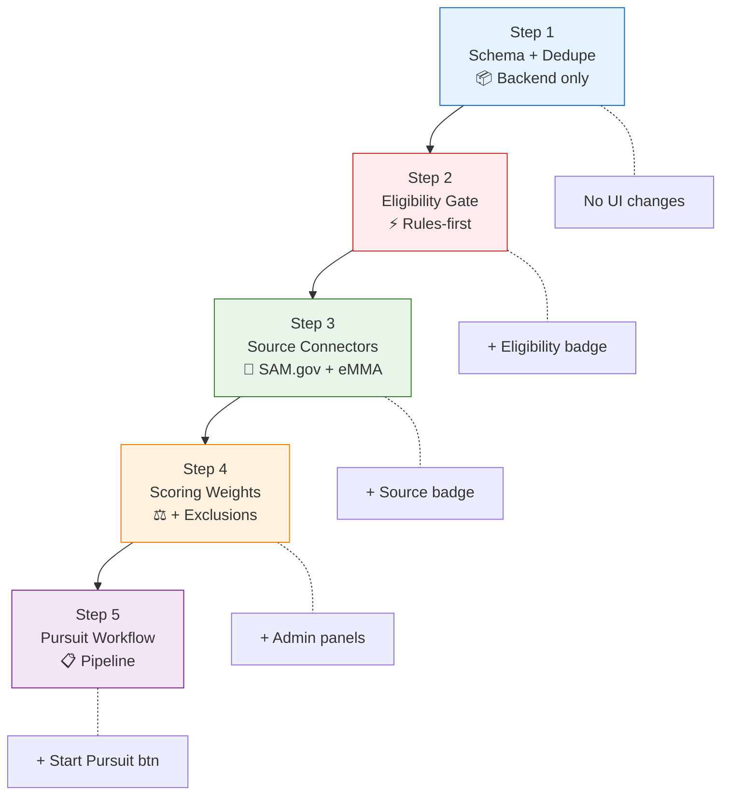
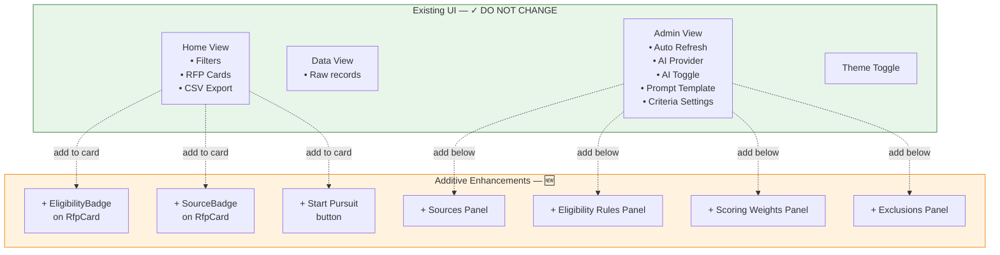
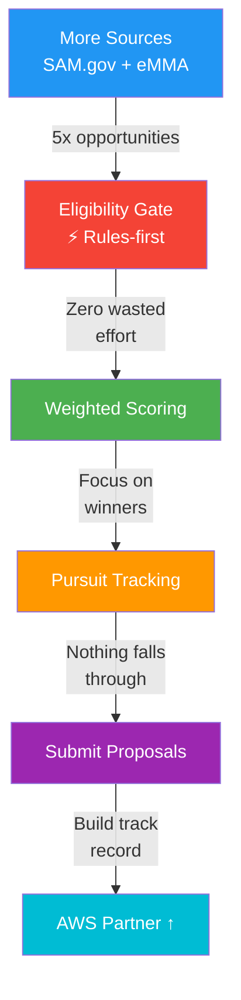
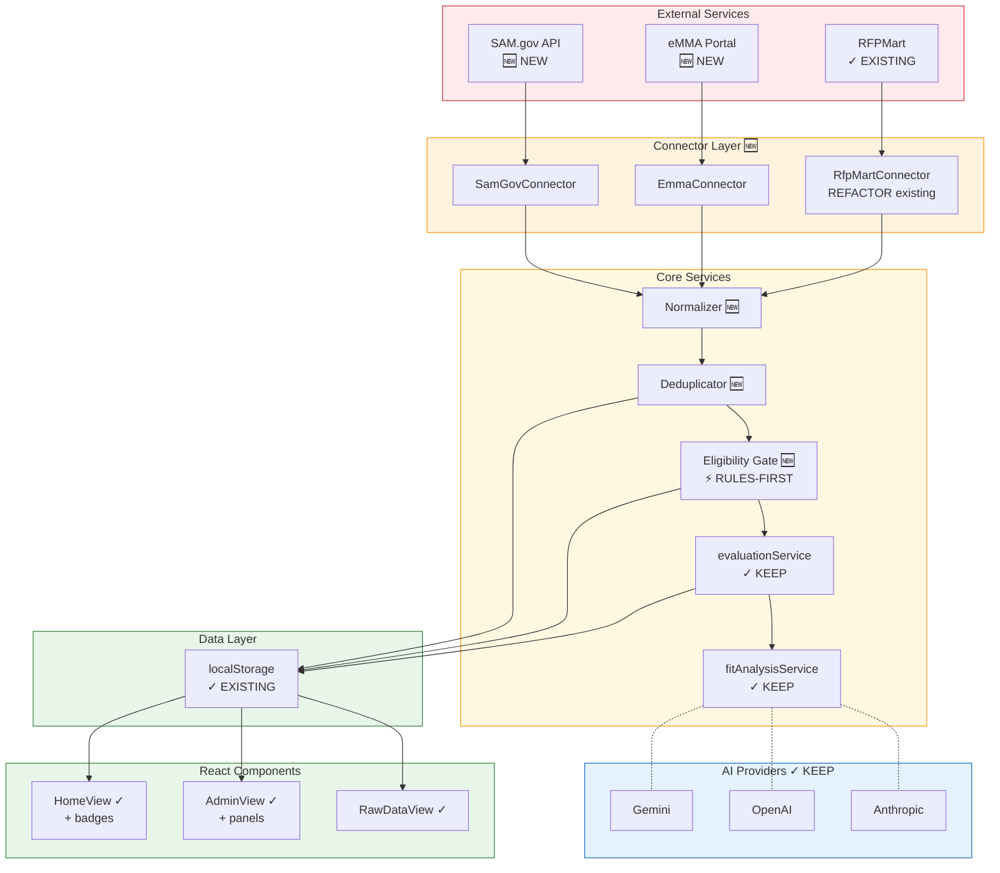
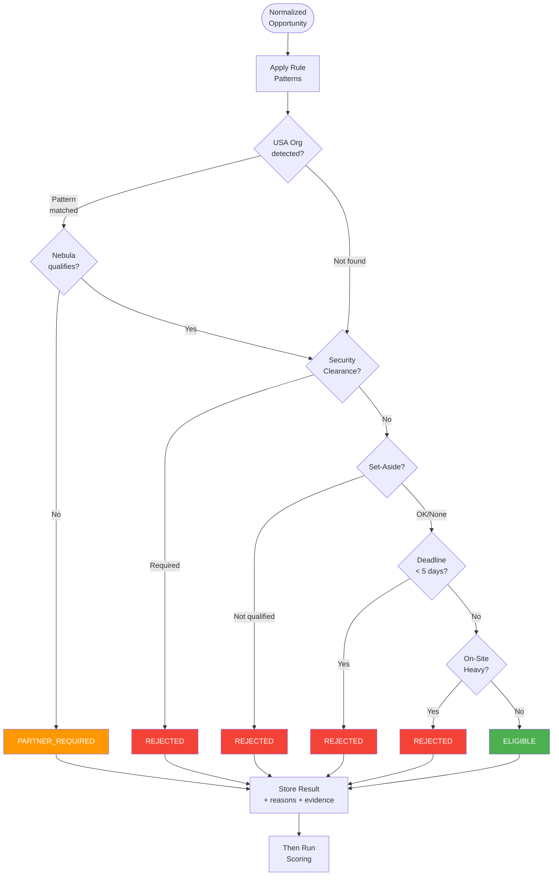
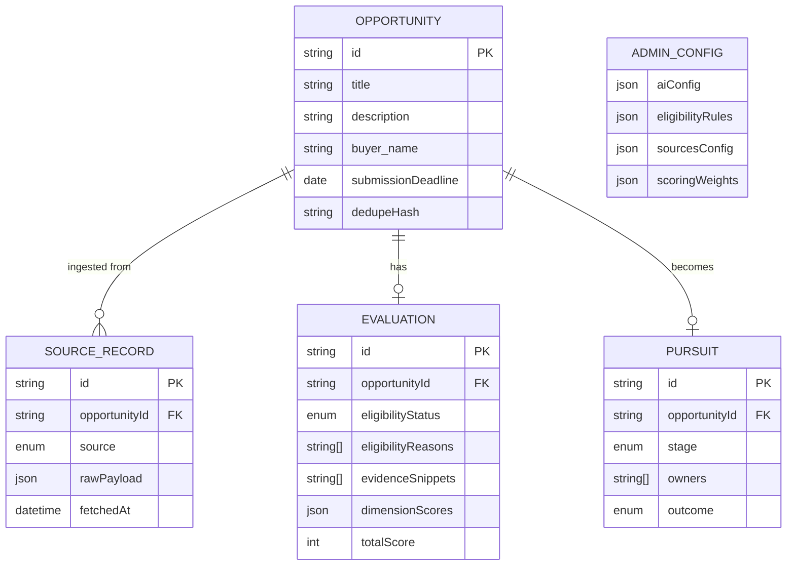
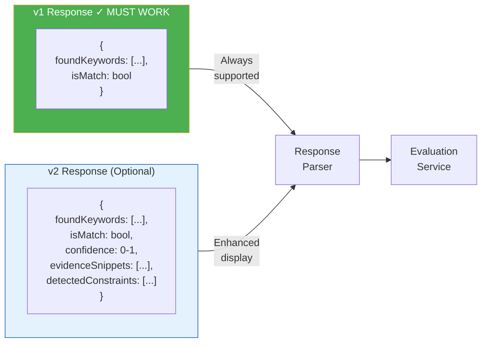
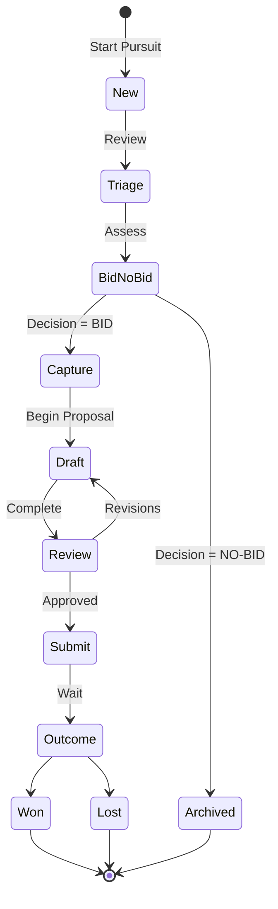

# RFP System Diagrams

## ⚠️ CTO Architecture Mandate

> [!CAUTION]
> These diagrams reflect the mandate: **Build on what exists. DO NOT redesign.**
> - Existing UI components are marked with ✓
> - New additions are marked with 🆕
> - Changes must be additive only

---

## Table of Contents

1. [Executive Diagrams](#executive-diagrams)
   - System Overview (showing what's new vs existing)
   - Execution Order
   - UI Changes Map
2. [Developer Diagrams](#developer-diagrams)
   - Technical Architecture
   - Eligibility Engine Flow
   - Data Model ERD
   - Admin Panel Layout

---

# Executive Diagrams

## 1. System Overview (Existing + New)

This diagram shows the current system (v1) and what gets added (v2).

```mermaid
flowchart LR
    subgraph Sources["📥 Data Sources"]
        RFPM["RFPMart<br/>✓ EXISTING"]
        SAM["SAM.gov<br/>🆕 NEW"]
        EMMA["eMMA<br/>🆕 NEW"]
    end
    
    subgraph Engine["🧠 RFP Engine"]
        INGEST["Ingestion<br/>✓ Existing + Connectors"]
        GATE["Eligibility Gate<br/>🆕 NEW<br/>⚡ RULES-FIRST"]
        SCORE["Scoring<br/>✓ EXISTING"]
    end
    
    subgraph UI["📺 UI Views"]
        HOME["Home View<br/>✓ KEEP AS-IS<br/>+ badges only"]
        DATA["Data View<br/>✓ UNCHANGED"]
        ADMIN["Admin View<br/>✓ KEEP<br/>+ new panels"]
    end
    
    Sources --> INGEST
    INGEST --> GATE
    GATE --> SCORE
    SCORE --> UI
    
    style RFPM fill:#4CAF50,color:#fff
    style SAM fill:#FFF3E0,stroke:#F57C00
    style EMMA fill:#FFF3E0,stroke:#F57C00
    style GATE fill:#FFF3E0,stroke:#F57C00
    style HOME fill:#E8F5E9,stroke:#388E3C
    style DATA fill:#E8F5E9,stroke:#388E3C
    style ADMIN fill:#E8F5E9,stroke:#388E3C
```



**Legend:**
- ✓ = Existing (do not change)
- 🆕 = New (additive enhancement)

---

## 2. Execution Order (MANDATORY)

> [!IMPORTANT]
> Follow this sequence exactly to avoid rework.



---

## 3. UI Changes Map (Minimal Additions Only)



---

## 4. Value Flow



---

# Developer Diagrams

## 5. Technical Architecture (Existing vs New)



---

## 6. Eligibility Engine Flow (Rules-First)

> [!CAUTION]
> **Implementation Rule:** Rules-based extraction first. AI is optional enhancement.



---

## 7. Data Model ERD



---

## 8. Admin Panel Layout (Existing + New)

```
┌─────────────────────────────────────────────────────────────────┐
│ ⚙️ Auto Refresh Scheduler                           ✓ EXISTING  │
│   Interval: [24] hours                                          │
└─────────────────────────────────────────────────────────────────┘

┌─────────────────────────────────────────────────────────────────┐
│ 🤖 AI Provider Selection                            ✓ EXISTING  │
│   [ Gemini ▼ ]  ✅ AI Analysis ENABLED                          │
└─────────────────────────────────────────────────────────────────┘

┌─────────────────────────────────────────────────────────────────┐
│ 📝 Core Prompt Template                             ✓ EXISTING  │
│   [editable prompt]                                             │
└─────────────────────────────────────────────────────────────────┘

┌─────────────────────────────────────────────────────────────────┐
│ 📊 Evaluation Criteria Settings                     ✓ EXISTING  │
│   ☑ Technical Relevance  ☑ Scope Fit  ...                      │
└─────────────────────────────────────────────────────────────────┘

                    ─────────── NEW PANELS BELOW ───────────

┌─────────────────────────────────────────────────────────────────┐
│ 🔌 Sources & Connectors                                    🆕   │
│ ☑ RFPMart    Last: 2h ago ✓   ☑ SAM.gov    Last: 4h ago ✓     │
│ ☐ eMMA       Not configured   ☐ GovTribe   Subscription         │
└─────────────────────────────────────────────────────────────────┘

┌─────────────────────────────────────────────────────────────────┐
│ 🚫 Eligibility Rules (Hard Gate)                           🆕   │
│ ☑ USA Org Only → PARTNER_REQUIRED                               │
│ ☑ Security Clearance → REJECT                                   │
│ ☑ Deadline < 5 days → REJECT                                    │
│ ☑ Heavy On-Site → REJECT                                        │
│ Out-of-Scope: [construction, hvac, asbestos...]                 │
└─────────────────────────────────────────────────────────────────┘

┌─────────────────────────────────────────────────────────────────┐
│ ⚖️ Scoring Weights & Thresholds                            🆕   │
│ Tech Relevance [●●●○○]   Scope Fit [●●●●●]                     │
│ "Good Fit" threshold: >= [4] / 6                               │
│ Must-pass: ☑ Scope Fit  ☑ Logistics                            │
└─────────────────────────────────────────────────────────────────┘

┌─────────────────────────────────────────────────────────────────┐
│ ➖ Negative Keywords / Exclusions                          🆕   │
│ ⚠️ Generic terms to review: [software] [systems] [Website]     │
│ Hard exclusions: [clearance required] [construction] [HVAC]    │
└─────────────────────────────────────────────────────────────────┘
```

---

## 9. RfpCard Component (Minimal Changes)

```
┌─────────────────────────────────────────────────────────────────┐
│ [SAM.gov] 🆕   Website Redesign Services                       │
│              [✓ Eligible] 🆕                                   │
├─────────────────────────────────────────────────────────────────┤
│ Agency: Department of Commerce                                  │
│ Deadline: Feb 15, 2026                                         │
│ Budget: ~$75,000                                               │
├─────────────────────────────────────────────────────────────────┤
│ Score: ●●●●○○ 4/6                                              │
│ Tech ✓  Scope ✓  Category ✓  Client ✓  Logistics ○  Skills ○  │
├─────────────────────────────────────────────────────────────────┤
│ [☐ Select]  [View Details]  [Start Pursuit] 🆕                 │
└─────────────────────────────────────────────────────────────────┘
```

**Changes to RfpCard (additive only):**
- 🆕 Source badge (top left)
- 🆕 Eligibility badge (next to title)
- 🆕 "Start Pursuit" button (bottom, enabled only if Eligible/Partner Required)

---

## 10. AI Response Compatibility



**Compatibility Rule:**
- If AI returns **only v1** → system works normally
- If AI returns **v2** → store and display evidence/confidence

---

## 11. Pursuit State Machine



---

## Export Notes

All diagrams use Mermaid syntax. For presentations:
1. **Executive audience:** Use diagrams 1, 2, 3, 4
2. **Developer audience:** Use diagrams 5, 6, 7, 8, 9, 10
3. **Full overview:** Use all diagrams

Diagrams can be exported via:
- GitHub/GitLab markdown rendering
- Mermaid Live Editor (PNG/SVG)
- Screenshot for presentations
