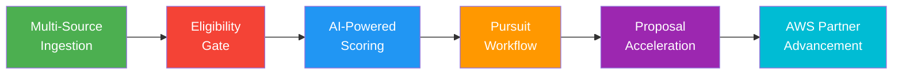
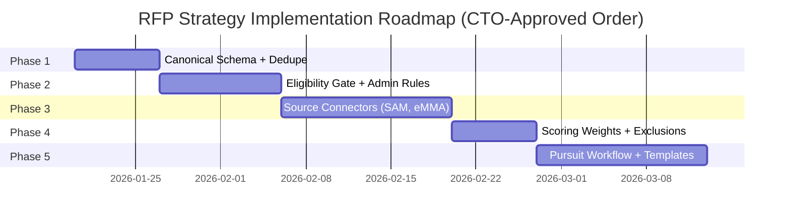
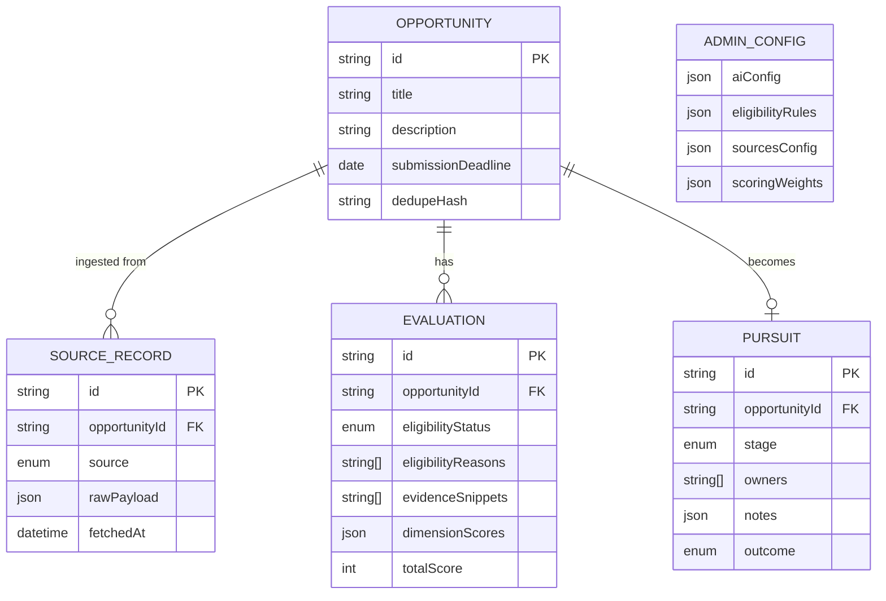

# Nebula Logix RFP Discovery & Pursuit System

## Strategic Vision

Transform Nebula Logix's RFP approach from **manual discovery** into an **automated pursuit decision system** that increases win rate, reduces wasted bid effort, and accelerates AWS partnership advancement.

---

## ⚠️ CTO Architecture Mandate

> [!CAUTION]
> **Non-Negotiable: Build on what exists. DO NOT redesign.**

The current system already has working views that **must remain intact**:
- **Home View**: Processed RFPs, filters, shortlist actions, CSV export
- **Data View**: Raw API records
- **Admin View**: Configuration controls
- **Theme Toggle**: Light/Dark mode

All new capabilities must be **additive enhancements**, not a redesign or re-platform.

---

## Executive Summary

### The Problem

| Challenge                    | Impact                                   |
| ---------------------------- | ---------------------------------------- |
| Single data source (RFPMart) | Limited, low-quality opportunities       |
| Manual filtering             | Hours wasted on ineligible RFPs          |
| No eligibility validation    | Bid on "USA-only" contracts we can't win |
| Generic scoring keywords     | False positives inflate pipeline         |
| No pursuit workflow          | Discovery → no action                    |
| Ad-hoc proposals             | Slow turnaround, inconsistent quality    |

### The Solution



### Success Metrics

| Metric                      | Current | Target (Q2 2026) |
| --------------------------- | ------- | ---------------- |
| RFP sources monitored       | 1       | 5+               |
| Proposals submitted/week    | 0-1     | 1+               |
| Win rate                    | Unknown | >10%             |
| AWS ARR through Marketplace | $0      | $1,500+/month    |

---

## Target Market Definition

### Project Profile

| Attribute            | Value                                                                                         |
| -------------------- | --------------------------------------------------------------------------------------------- |
| **Budget Range**     | Under $100k initially (ramp to $250k+ with track record)                                      |
| **Ideal Scope**      | Website redesigns, custom portals, cloud migration, API integration, serverless modernization |
| **Geography**        | U.S.-based (federal, state, local)                                                            |
| **Minimum Deadline** | 5 days out for proposal preparation                                                           |
| **Delivery Model**   | Remote-first, minimal on-site                                                                 |

### Technology Alignment

**Strong Fit:**
- React, Next.js, TypeScript frontends
- AWS serverless (Lambda, API Gateway, DynamoDB)
- Cloud migration & modernization
- API development & integration
- Data platforms & dashboards

**Moderate Fit (with partners):**
- CMS implementations (Drupal, WordPress)
- Content strategy & IA
- Mobile applications

**Avoid (Negative Keywords):**
- Construction, HVAC, plumbing, electrical works
- Asbestos, roofing, demolition
- Security clearance required
- On-site 5 days/week

---

## Strategic Phases Overview

> [!IMPORTANT]
> **Execution order is critical to avoid rework.** Follow this sequence exactly.



| Phase       | Priority | Focus                               | UI Changes                                        |
| ----------- | -------- | ----------------------------------- | ------------------------------------------------- |
| **Phase 1** | P0       | Canonical schema + dedupe           | None (backend only)                               |
| **Phase 2** | P0       | Eligibility Gate + Admin rules      | Add eligibility badge to Home                     |
| **Phase 3** | P1       | Source connectors (SAM.gov, eMMA)   | Add source badge to RfpCard                       |
| **Phase 4** | P2       | Scoring weights + negative keywords | Update Admin with weights panel                   |
| **Phase 5** | P3       | Pursuit workflow                    | Add "Start Pursuit" action, optional Pursuits tab |

---

## Detailed Phase Plans

### Phase 1: Canonical Schema + Deduplication (Foundation)

> [!NOTE]
> **UI Impact: NONE** — This is purely backend/data layer work.

**Goal:** Establish unified data model without changing any views.

**Deliverables:**
1. `Opportunity` entity (canonical normalized record)
2. `SourceRecord` entity (raw per-source payload, linked to Opportunity)
3. Deduplication logic (hash-based + fuzzy title matching)
4. No UI changes

**Why first?** All subsequent features depend on a clean, deduplicated data foundation.

---

### Phase 2: Eligibility Gating (CRITICAL)

> [!CAUTION]
> This is the **#1 missing capability**. It executes **BEFORE** fit scoring.
> 
> **Implementation rule:** Eligibility must be **rule-driven first**, with AI extraction as optional enhancement (not dependency).

**Goal:** Hard-reject ineligible opportunities before scoring to eliminate wasted effort.

**Eligibility Output (Required):**
```typescript
{
  status: 'ELIGIBLE' | 'PARTNER_REQUIRED' | 'REJECTED',
  reasons: string[],           // Machine-readable + human-readable
  evidenceSnippets: string[]   // Short excerpts that triggered the rule
}
```

**Admin-Configurable Rule Sets:**

| Rule Category           | Examples                                    | Action                     |
| ----------------------- | ------------------------------------------- | -------------------------- |
| US-only / onshore       | "USA organization only", "onshore required" | PARTNER_REQUIRED or REJECT |
| Security clearance      | "secret clearance", "TS/SCI"                | REJECT                     |
| Set-asides              | 8(a), SDVOSB, HUBZone, WOSB                 | REJECT if not qualified    |
| Location constraints    | "must be in Maryland", "100% on-site"       | REJECT                     |
| Minimum deadline        | < 5 days from discovery                     | REJECT                     |
| Out-of-scope industries | Construction, HVAC, asbestos, demolition    | REJECT                     |

**UI Changes (Minimal):**
- Add eligibility status badge on each RFP card: `✓ Eligible` / `👥 Partner Required` / `✗ Rejected`
- Show "Why" (evidence snippets) on expand/click

**Admin Panel Addition:**
New section: **"Eligibility Rules (Hard Gate)"**
- Enable/disable rules per category
- Custom patterns input
- Evidence display toggle

---

### Phase 3: Source Connectors (Pipeline Expansion)

**Goal:** Add SAM.gov and eMMA to expand opportunity pipeline.

**Connector Priority:**
1. **SAM.gov** — Federal opportunities, structured API
2. **Maryland eMMA** — State/local, web scraping required
3. **BidNet** — Later
4. **GovTribe** — Later (subscription required)

**Admin Panel Addition:**
New section: **"Sources & Connectors"**
- Enable/disable each source
- Per-source refresh cadence (override global)
- Per-source query/filter settings
- Health status: last fetch, last success, error count, backoff state

**UI Changes (Minimal):**
- Add source badge on RfpCard (e.g., "SAM.gov", "RFPMart")

---

### Phase 4: Scoring Weights & Negative Keywords

**Goal:** Improve scoring precision by adding weights and exclusions.

**Admin Panel Additions:**

**Section: "Scoring Weights & Thresholds"**
- Weight per dimension (default: equal)
- "Good Fit" threshold (e.g., ≥4/6)
- "Must-pass" dimensions (e.g., Scope Fit + Logistics must be 1)

**Section: "Negative Keywords / Exclusions"**
- Exclusion dictionary to reduce false positives
- Outcome options: hard reject (eligibility) or heavy score penalty (scoring)

**Immediate Cleanup Required:**
> [!WARNING]
> Current keyword lists contain overly generic terms that inflate matches:
> - "software", "systems", "Website", "UI", "UX"
> 
> These should be:
> - Moved to low-weight signals, OR
> - Removed entirely, OR
> - Used only when combined with specific terms (React, Next, AWS)

---

### Phase 5: Pursuit Workflow

**Goal:** Track opportunities through bid/no-bid decision to submission.

**Implementation Options:**
1. **Preferred:** Add "Start Pursuit" button on RfpCard + "Pursuit Drawer" in Home
2. **Alternative:** New top-level "Pursuits View" tab (only if drawer approach is insufficient)

**Pursuit Entity:**
```typescript
interface Pursuit {
  id: string;
  opportunityId: string;
  stage: PursuitStage;        // NEW → TRIAGE → BID/NO-BID → CAPTURE → DRAFT → REVIEW → SUBMIT → OUTCOME
  owners: string[];
  notes: Note[];
  deadlines: DeadlineInfo;
  submissionMethod: string;
  outcome?: 'WON' | 'LOST' | 'CANCELLED';
}
```

**UI Changes:**
- "Start Pursuit" button (enabled only if Eligible or Partner Required)
- Pipeline stage indicator once pursuit exists

---

## AI Compatibility Requirements

> [!IMPORTANT]
> **Backward Compatibility is mandatory.** The system must work with both old and new AI responses.

**Current AI Response (v1 — must continue working):**
```json
{
  "foundKeywords": ["React", "AWS"],
  "isMatch": true
}
```

**Extended AI Response (v2 — optional, preferred):**
```json
{
  "foundKeywords": ["React", "AWS"],
  "isMatch": true,
  "confidence": 0.85,
  "evidenceSnippets": ["...requires experience in React and AWS Lambda..."],
  "detectedConstraints": ["USA-only", "onsite-required"]
}
```

**Compatibility Rule:**
- If AI returns **only v1 JSON** → system works normally
- If AI returns **v2 JSON** → store and display evidence/confidence

---

## Data Model Summary



---

## AWS Partnership Pathway

**Strategy:**
1. Drive ALL new business through AWS Marketplace
2. Document every delivery with AWS PDR (Partner Delivery Report)  
3. Pursue AWS co-funding for POC/demos
4. Track ARR monthly against $1,500 target

**Current State:** Registered Partner (lowest tier)
**Q2 2026 Target:** Validated Partner with $1,500+ ARR

---

## Immediate Next Steps (This Week)

1. ✅ Complete Phase 1-2 architecture design
2. 🔲 Implement canonical schema + dedupe (no UI changes)
3. 🔲 Implement eligibility rules engine (rule-driven, not AI-dependent)
4. 🔲 Add eligibility badge to Home view
5. 🔲 Clean up overly generic keywords in Admin

---

## Related Documents

- [ARCHITECTURE.md](./ARCHITECTURE.md) - Technical architecture & data model
- [IMPLEMENTATION.md](./IMPLEMENTATION.md) - Step-by-step implementation guide
- [DIAGRAMS.md](./DIAGRAMS.md) - All system diagrams and flows
