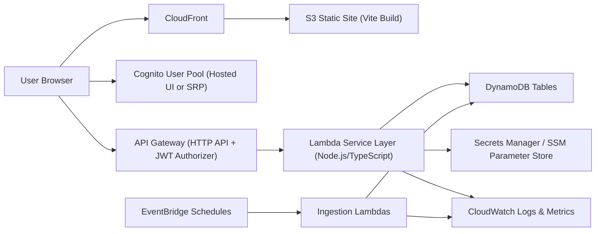
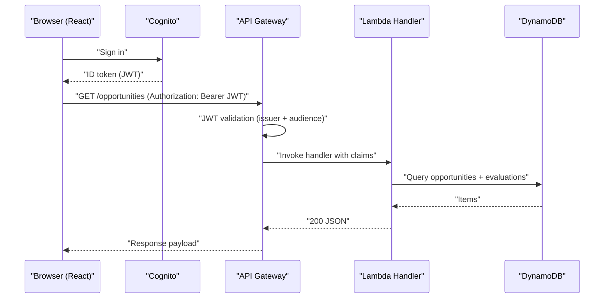

# AWS Migration Plan: Convex + Clerk -> API Gateway + Lambda + DynamoDB + Cognito

## 1. Purpose
This document is the full migration implementation plan for moving this application from:
- Convex backend + Convex DB
- Clerk authentication
- Current deployment flow

To:
- AWS API Gateway + AWS Lambda backend
- Amazon DynamoDB data layer
- Amazon Cognito authentication
- AWS-native deployment pipeline

This plan is written so a junior developer can execute it step-by-step.

---

## 2. Migration Goals
- Replace Convex functions with AWS Lambda handlers.
- Replace Convex database tables with DynamoDB tables.
- Replace Clerk auth with Cognito user pools and groups.
- Keep existing frontend behavior and admin workflows.
- Minimize downtime at cutover.
- Provide rollback path.

## 2.1 Non-Goals
- Full feature redesign.
- Major UI rewrite.
- DynamoDB single-table advanced optimization on day 1.

---

## 3. Current State (Baseline)
- Frontend: React + Vite.
- Current backend calls in frontend: `api.*` and `internal.*` via Convex client.
- Current core used data model (see `/docs/convex-usage-audit-2026-02-21.md`):
  - `users`
  - `opportunities`
  - `sources`
  - `evaluations`
  - `eligibilityRules`
  - `ingestionLogs`
  - `statsAggregation`

---

## 4. Target AWS Architecture



### 4.1 AWS Services to Use
- Frontend hosting: S3 + CloudFront.
- Auth: Cognito User Pool + App Client.
- API: API Gateway HTTP API with JWT authorizer.
- Compute: Lambda (TypeScript).
- Database: DynamoDB (table-per-entity).
- Scheduled jobs: EventBridge Scheduler/Rules.
- Secrets: Secrets Manager (preferred) + SSM Parameter Store.
- Observability: CloudWatch Logs, CloudWatch Alarms, X-Ray (optional phase 2).
- Infrastructure as Code: AWS CDK (TypeScript).
- CI/CD: GitHub Actions (deploy frontend + deploy CDK stacks).

---

## 5. Repository Changes (Planned)

Create this structure:

```text
infra/
  cdk.json
  package.json
  bin/
    app.ts
  lib/
    app-stack.ts
    auth-stack.ts
    data-stack.ts
    api-stack.ts
    jobs-stack.ts
    frontend-stack.ts

backend/
  package.json
  src/
    handlers/
      users/
      opportunities/
      sources/
      eligibilityRules/
      ingestion/
    services/
      auth/
      repositories/
      ingestion/
      eligibility/
    models/
    utils/
    tests/

src/
  aws/
    auth/
    api/
    hooks/
```

---

## 6. DynamoDB Data Design (Junior-Friendly: Table-Per-Entity)

Use one table per logical entity to keep implementation simple and safe.

## 6.1 Table Definitions

### `users`
- PK: `userId` (Cognito `sub`)
- Attributes:
  - `email`
  - `name`
  - `imageUrl`
  - `role`
  - `createdAt`
  - `lastLoginAt`
- GSI:
  - `email-index` (`email`)

### `opportunities`
- PK: `opportunityId` (UUID generated by backend)
- Attributes:
  - `externalIds` (list)
  - `title`
  - `fullDescription`
  - `buyer`
  - `location`
  - `postedDate`
  - `dueDate`
  - `categories`
  - `setAside`
  - `source`
  - `sourceUrl`
  - `ingestedAt`
  - `lastUpdatedAt`
  - `needsDetailFetch`
- GSI:
  - `source-postedDate-index` (`source`, `postedDate`)
  - `source-dueDate-index` (`source`, `dueDate`)
  - `source-lastUpdatedAt-index` (`source`, `lastUpdatedAt`)
  - `externalRef-index` (synthetic `externalRefKey = source#externalId`, sort `lastUpdatedAt`)

### `evaluations`
- PK: `opportunityId`
- Attributes:
  - `eligibility`
  - `scoring`
  - `evaluatedAt`
  - `evaluatedBy`
- GSI:
  - `eligibilityStatus-index` (`eligibility.status`, `evaluatedAt`)

### `sources`
- PK: `sourceName`
- Attributes mirror current source config and health fields.

### `eligibilityRules`
- PK: `ruleId`
- Attributes mirror current rule record.

### `ingestionLogs`
- PK: `source`
- SK: `startedAt`
- Attributes:
  - `status`
  - `fetchedCount`
  - `newCount`
  - `updatedCount`
  - `duplicateCount`
  - `errorCount`
  - `errors`
  - `completedAt`

### `statsAggregation`
- PK: `key`
- Attributes:
  - `counts`
  - `lastUpdatedAt`

---

## 7. Cognito Authentication Design

## 7.1 User Pool Setup
- Create one Cognito user pool per environment (`dev`, `staging`, `prod`).
- Create app client (no secret for SPA).
- Enable:
  - `email` sign-in
  - `USER_PASSWORD_AUTH` or Hosted UI (recommended: Hosted UI + Authorization Code + PKCE).

## 7.2 Role Model
Use Cognito groups:
- `admin`
- `manager`
- `user`
- `viewer`

Lambda auth utility must map JWT claims (`cognito:groups`) to app role.

## 7.3 Frontend Auth Migration
- Remove Clerk provider and hooks from `index.tsx` and auth components.
- Add Amplify Auth (or AWS SDK auth helper) with Cognito config:
  - `VITE_AWS_REGION`
  - `VITE_COGNITO_USER_POOL_ID`
  - `VITE_COGNITO_CLIENT_ID`
  - `VITE_COGNITO_DOMAIN` (if Hosted UI)
- Build auth wrapper with:
  - `signIn`
  - `signOut`
  - `getCurrentUser`
  - `getIdToken`

## 7.4 API Authorization
- API Gateway JWT authorizer:
  - issuer = Cognito user pool URL
  - audience = app client id
- Pass claims to Lambda via request context.

---

## 8. API Migration Map (Convex -> REST)

Implement routes in API Gateway and matching Lambda handlers.

### 8.1 Users
- `POST /users/sync`
- `GET /users/me`

### 8.2 Sources
- `GET /sources`
- `GET /sources/enabled`
- `GET /sources/{name}`
- `GET /sources/health-summary`
- `POST /sources/init-defaults` (admin)
- `PATCH /sources/{name}` (admin)
- `POST /sources/migrate-samgov-daily` (admin)

### 8.3 Opportunities
- `GET /opportunities?limit=&source=&cursor=`
- `GET /opportunities/with-evaluations?limit=&source=&onlyEligible=`
- `GET /opportunities/debug/samgov`
- `GET /opportunities/count`
- `DELETE /opportunities/samgov` (admin)
- `DELETE /opportunities/rfpmart-csv` (admin)
- `DELETE /opportunities/all` (admin)

### 8.4 Eligibility Rules
- `GET /eligibility/rules`
- `GET /eligibility/stats`
- `POST /eligibility/rules/init`
- `PATCH /eligibility/rules/{ruleId}`
- `POST /eligibility/rules/{ruleId}/keywords`
- `DELETE /eligibility/rules/{ruleId}/keywords`
- `POST /eligibility/evaluate/{opportunityId}`
- `POST /eligibility/evaluate-all`
- `DELETE /eligibility/evaluations/reset`
- `GET /eligibility/rules/export`

### 8.5 Ingestion
- `POST /ingestion/rfpmart/fetch`
- `POST /ingestion/rfpmart/csv/upload`
- `POST /ingestion/rfpmart/enrich`
- `POST /ingestion/samgov/fetch`
- `POST /ingestion/samgov/backfill`
- `POST /ingestion/scrape-detail`
- `GET /ingestion/logs?source=&limit=`
- `GET /ingestion/stats?source=&daysBack=`

---

## 9. Lambda Implementation Plan

## 9.1 Coding Standard
- Runtime: Node.js 20.x.
- Language: TypeScript.
- Validation: `zod`.
- Keep handlers thin:
  - Parse request
  - Validate input
  - Call service
  - Return response

## 9.2 Layering
- `handlers/`: API Gateway event adapters.
- `services/`: business logic.
- `repositories/`: DynamoDB reads/writes.
- `auth/`: JWT claims parsing, role checks.

## 9.3 Shared Utilities
- `response.ts` for standardized JSON responses.
- `errors.ts` for app errors and HTTP mapping.
- `logger.ts` with request id.

---

## 10. Scheduled Jobs (EventBridge)

Migrate Convex crons to EventBridge:
- `ingest-sam-gov` every 6 hours.
- `reset-daily-counts` daily at `00:00 UTC`.
- `enrich-rfpmart-csv` every 30 minutes.
- Optional: `rfpmart` scheduled ingest every 6 hours.

Each scheduled Lambda:
- logs start/end and outcome to `ingestionLogs`.
- updates `sources` health counters.

---

## 11. Data Migration Plan (Convex -> DynamoDB)

## 11.1 Strategy
- Run one-time export from Convex.
- Transform JSON shape to DynamoDB item shapes.
- Import in dependency-safe order.

## 11.2 Export Order
1. `users`
2. `sources`
3. `eligibilityRules`
4. `opportunities`
5. `evaluations`
6. `ingestionLogs`
7. `statsAggregation`

## 11.3 Import Order
1. `users`
2. `sources`
3. `eligibilityRules`
4. `opportunities`
5. `evaluations`
6. `ingestionLogs`
7. `statsAggregation`

## 11.4 Validation Checklist
- Counts per table match source counts.
- Spot-check 20 random `opportunities`.
- Spot-check 20 `evaluations` linked to opportunity IDs.
- Validate eligibility status totals.

---

## 12. Frontend Migration Plan

## 12.1 Data Layer
- Replace `convex/react` hooks with API hooks (TanStack Query recommended).
- Build `src/aws/api/client.ts`:
  - inject bearer token from Cognito.
  - handle JSON errors consistently.

## 12.2 Hook Replacement Pattern
- Old: `useQuery(api.opportunities.listWithEvaluations, {...})`
- New: `useQuery({ queryKey: [...], queryFn: () => api.getOpportunitiesWithEvaluations(...) })`

## 12.3 Mutation Replacement
- Old: `useMutation(api.eligibilityRules.evaluateAllPending)`
- New: `useMutation({ mutationFn: (payload) => api.evaluateAllPending(payload) })`

## 12.4 Environment Variables (Frontend)
- `VITE_AWS_REGION`
- `VITE_COGNITO_USER_POOL_ID`
- `VITE_COGNITO_CLIENT_ID`
- `VITE_API_BASE_URL`
- `VITE_POSTHOG_KEY` (if retained)
- `VITE_POSTHOG_HOST` (if retained)

---

## 13. IaC (CDK) Plan

## 13.1 Stacks
- `AuthStack`
- `DataStack`
- `ApiStack`
- `JobsStack`
- `FrontendStack`

## 13.2 Deployment Order
1. `AuthStack`
2. `DataStack`
3. `ApiStack`
4. `JobsStack`
5. `FrontendStack`

## 13.3 Outputs Required
- `UserPoolId`
- `UserPoolClientId`
- `ApiUrl`
- `CloudFrontDomainName`
- Table names/ARNs

---

## 14. CI/CD Plan

## 14.1 Pipelines
- Backend pipeline:
  - install
  - lint
  - unit tests
  - `cdk synth`
  - `cdk deploy`
- Frontend pipeline:
  - install
  - build
  - deploy `dist/` to S3
  - CloudFront invalidation

## 14.2 Branch Strategy
- `main` -> production.
- `develop` -> staging.
- feature branches -> preview stacks optional.

---

## 15. Security Requirements

Mandatory:
- Least-privilege IAM roles.
- API JWT validation at gateway.
- Role checks in Lambda for admin endpoints.
- Secrets not in source control.
- DynamoDB encryption at rest.
- CloudFront + S3 with OAC and blocked public bucket access.

Recommended:
- AWS WAF on CloudFront.
- CloudTrail enabled.
- Config rules + Security Hub baseline.

---

## 16. Observability and Alerts

## 16.1 CloudWatch Metrics/Alarms
- API 5xx > threshold.
- Lambda error count > threshold.
- Lambda duration p95 > threshold.
- DynamoDB throttles > 0.
- Scheduled job failures > 0.

## 16.2 Logging Standard
- Log fields:
  - `requestId`
  - `route`
  - `userId` (if available)
  - `status`
  - `durationMs`

---

## 17. Migration Phases and Detailed Checklists

## Phase 0: Preparation (2-3 days)
- [ ] Confirm business freeze window.
- [ ] Create migration branch.
- [ ] Create AWS accounts or environment boundaries (`dev/staging/prod`).
- [ ] Capture baseline metrics.
- [ ] Export Convex usage audit snapshot.

Definition of done:
- [ ] Stakeholder sign-off on scope.
- [ ] No unknown blocking dependencies.

## Phase 1: AWS Foundation (3-5 days)
- [ ] Initialize CDK project.
- [ ] Implement base stacks skeleton.
- [ ] Create Cognito user pool and app client.
- [ ] Create DynamoDB tables + GSIs.
- [ ] Create API Gateway and one health endpoint Lambda.

Definition of done:
- [ ] `GET /health` returns 200 via API Gateway.

## Phase 2: Auth Migration (3-5 days)
- [ ] Replace Clerk in frontend with Cognito auth wrapper.
- [ ] Add sign-in/out UI behavior parity.
- [ ] Configure API JWT authorizer.
- [ ] Implement role middleware and test admin route.

Definition of done:
- [ ] Authenticated user can load protected views.
- [ ] Unauthorized user cannot call admin routes.

## Phase 3: Core Data APIs (1-2 weeks)
- [ ] Implement repositories for `sources`, `opportunities`, `evaluations`, `eligibilityRules`.
- [ ] Implement API routes from section 8.
- [ ] Implement pagination and filtering parity.

Definition of done:
- [ ] Home and Admin views read data from AWS APIs.

## Phase 4: Ingestion + Jobs (1 week)
- [ ] Implement RFPMart fetch flow.
- [ ] Implement RFPMart CSV upload flow.
- [ ] Implement SAM.gov fetch and backfill.
- [ ] Implement ingestion logs and source health updates.
- [ ] Add EventBridge schedules.

Definition of done:
- [ ] Scheduled jobs run and write logs.

## Phase 5: Frontend Full Cutover (1 week)
- [ ] Remove Convex client dependencies and hooks.
- [ ] Switch all queries/mutations to API client.
- [ ] Verify all admin actions.

Definition of done:
- [ ] No runtime Convex dependency in frontend.

## Phase 6: Data Migration + Validation (3-5 days)
- [ ] Export Convex data.
- [ ] Run transform scripts.
- [ ] Import into DynamoDB.
- [ ] Validate counts and sample records.

Definition of done:
- [ ] Validation checklist passes.

## Phase 7: Cutover and Hypercare (2-3 days + 1 week monitor)
- [ ] Freeze writes (short window).
- [ ] Final delta migration.
- [ ] Deploy frontend with AWS API URL.
- [ ] Monitor alarms and logs.

Definition of done:
- [ ] Stable traffic with no sev-1/sev-2 issues for 7 days.

---

## 18. Cutover and Rollback

## 18.1 Cutover Steps
1. Announce maintenance window.
2. Disable ingestion jobs on old system.
3. Export final delta data.
4. Import final delta to DynamoDB.
5. Deploy frontend with production AWS env vars.
6. Run smoke tests.
7. Open traffic.

## 18.2 Rollback Steps
1. Revert frontend environment to old Convex/Clerk build.
2. Re-enable old ingestion jobs.
3. Keep AWS stack up for forensic analysis.
4. Publish incident report and next retry plan.

---

## 19. Junior Developer Task Board (Ticket Templates)

Create tickets with this template:
- Title: `AWS-MIG-XXX <short task>`
- Description:
  - Inputs
  - Steps
  - Output
  - Acceptance criteria
  - Test evidence required

Example tickets:
- `AWS-MIG-001` Create `AuthStack` with Cognito user pool.
- `AWS-MIG-002` Implement JWT authorizer in API Gateway.
- `AWS-MIG-003` Create DynamoDB `opportunities` table with GSIs.
- `AWS-MIG-004` Implement `GET /opportunities/with-evaluations`.
- `AWS-MIG-005` Implement `POST /ingestion/rfpmart/fetch`.
- `AWS-MIG-006` Replace Clerk provider in frontend with Cognito provider.
- `AWS-MIG-007` Replace Convex `listEnabled` call with REST endpoint.
- `AWS-MIG-008` Build Convex export -> DynamoDB import script.
- `AWS-MIG-009` Create CloudWatch alarms and dashboard.
- `AWS-MIG-010` Execute cutover runbook in staging.

---

## 20. Sequence Diagram: Authenticated Request Path



---

## 21. Risks and Mitigations
- Risk: auth role mismatch after Clerk -> Cognito.
  - Mitigation: map roles only from Cognito groups and test each role in staging.
- Risk: DynamoDB query model mismatch.
  - Mitigation: implement table + GSI integration tests before frontend cutover.
- Risk: ingestion behavior divergence.
  - Mitigation: compare daily counts and sample records against current production for 7 days.
- Risk: operational blind spots.
  - Mitigation: CloudWatch alarms and dashboards before production cutover.

---

## 22. Immediate Next Actions
1. Approve this architecture and migration scope.
2. Decide AWS account/environment strategy (`dev/staging/prod` in one account or separate accounts).
3. Create `infra/` CDK project and commit baseline stacks.
4. Start with Phase 1 + Phase 2 in staging only.

---

## 23. Implementation Workbook (Junior Developer Execution Guide)

This section is the exact implementation order, with concrete files and commands.
Do not skip steps or reorder unless explicitly approved in code review.

## 23.1 Prerequisites Checklist
- [ ] Install Node.js 20.x and npm 10+.
- [ ] Install AWS CLI v2 and run `aws configure`.
- [ ] Install AWS CDK CLI: `npm i -g aws-cdk`.
- [ ] Confirm GitHub repo secrets can be edited.
- [ ] Confirm access to Convex project for one-time export.
- [ ] Confirm access to Clerk dashboard for user export.

## 23.2 AWS Account Strategy (Recommended)
- `dev` account: daily development and destructive testing.
- `staging` account: production-like validation and cutover rehearsal.
- `prod` account: production traffic only.
- Create IAM role per environment for CI deploy:
  - `github-actions-cdk-deploy-role`
  - `github-actions-frontend-deploy-role`

## 23.3 Naming Convention
- Stack name pattern: `rfp-discovery-<env>-<layer>`.
- DynamoDB table pattern: `rfp-<env>-<entity>`.
- S3 website bucket pattern: `rfp-discovery-<env>-web`.
- CloudFront distribution comment pattern: `rfp-discovery-<env>`.

## 23.4 Current File Migration Map (This Repository)

Use this as the required refactor map so no Convex/Clerk usage is missed.

| Current file | Action during migration | New file(s) |
|---|---|---|
| `index.tsx` | Remove `ClerkProvider` and `ConvexProviderWithClerk`; wrap app with Cognito/Auth provider | `src/aws/auth/AuthProvider.tsx` |
| `App.tsx` | Replace all `useQuery/useMutation/useAction` Convex calls with API client hooks | `src/aws/hooks/useOpportunities.ts`, `src/aws/hooks/useAdminActions.ts` |
| `components/AuthButtons.tsx` | Replace Clerk auth controls with Cognito sign-in/sign-out | `src/aws/auth/AuthButtonsAws.tsx` |
| `src/components/providers/PostHogIdentifier.tsx` | Switch identity source from Clerk user to Cognito user profile | keep same file, replace internals |
| `components/admin/SourcesAdmin.tsx` | Replace Convex actions/mutations with REST calls | `src/aws/api/sourcesApi.ts` |
| `components/admin/EligibilityRulesAdmin.tsx` | Replace Convex queries/mutations with REST calls | `src/aws/api/eligibilityApi.ts` |
| `components/admin/SamGovManager.tsx` | Replace Convex query/action with REST calls | `src/aws/api/ingestionApi.ts` |
| `components/admin/CsvUpload.tsx` | Replace Convex CSV action with API upload endpoint | `src/aws/api/ingestionApi.ts` |
| `components/admin/IngestionLogs.tsx` | Replace Convex query with REST calls | `src/aws/api/ingestionApi.ts` |
| `components/admin/DatabaseSettings.tsx` | Replace Convex count/delete with REST calls | `src/aws/api/opportunitiesApi.ts` |
| `convex/` folder | Freeze for reference, then remove after cutover | `backend/src/` replacement code |
| `.env.local.example` | Replace Convex/Clerk vars with AWS vars | same file |
| `package.json` | Remove Convex/Clerk deps, add AWS/auth/query deps | same file |

## 23.5 New Files to Create (Minimum Required)
- `infra/bin/app.ts`
- `infra/lib/auth-stack.ts`
- `infra/lib/data-stack.ts`
- `infra/lib/api-stack.ts`
- `infra/lib/jobs-stack.ts`
- `infra/lib/frontend-stack.ts`
- `backend/src/handlers/health/getHealth.ts`
- `backend/src/handlers/opportunities/getWithEvaluations.ts`
- `backend/src/handlers/sources/getSources.ts`
- `backend/src/handlers/eligibility/evaluateAll.ts`
- `backend/src/handlers/ingestion/postRfpmartFetch.ts`
- `backend/src/services/repositories/opportunitiesRepo.ts`
- `backend/src/services/repositories/evaluationsRepo.ts`
- `backend/src/services/repositories/sourcesRepo.ts`
- `backend/src/services/repositories/eligibilityRulesRepo.ts`
- `backend/src/services/auth/authorize.ts`
- `backend/src/utils/response.ts`
- `backend/src/utils/errors.ts`
- `backend/src/utils/logger.ts`
- `backend/scripts/export-convex.mjs`
- `backend/scripts/transform-for-dynamodb.mjs`
- `backend/scripts/import-dynamodb.mjs`
- `src/aws/api/client.ts`
- `src/aws/api/opportunitiesApi.ts`
- `src/aws/api/sourcesApi.ts`
- `src/aws/api/eligibilityApi.ts`
- `src/aws/api/ingestionApi.ts`
- `src/aws/auth/cognito.ts`
- `src/aws/auth/AuthProvider.tsx`

## 24. Command Runbook (Copy/Paste)

Run from repo root unless noted.

## 24.1 Bootstrap Infra Project

```bash
mkdir -p infra && cd infra
npm init -y
npm i aws-cdk-lib constructs
npm i -D aws-cdk typescript ts-node @types/node
npx cdk init app --language typescript
mkdir -p lib
```

## 24.2 Bootstrap Backend Project

```bash
cd /Users/atem/sites/nebula/rfp/archive/rfp-discovery_convex_v0
mkdir -p backend/src/{handlers,services,repositories,utils,tests} backend/scripts
cd backend
npm init -y
npm i @aws-sdk/client-dynamodb @aws-sdk/lib-dynamodb zod jsonwebtoken
npm i -D typescript tsx vitest @types/node @types/jsonwebtoken eslint
npx tsc --init
```

## 24.3 Bootstrap Frontend AWS Client Layer

```bash
cd /Users/atem/sites/nebula/rfp/archive/rfp-discovery_convex_v0
npm i @tanstack/react-query aws-amplify
mkdir -p src/aws/{api,auth,hooks}
```

## 24.4 CDK Deploy Sequence

```bash
cd /Users/atem/sites/nebula/rfp/archive/rfp-discovery_convex_v0/infra
npx cdk bootstrap aws://<ACCOUNT_ID>/<REGION>
npx cdk synth
npx cdk deploy rfp-discovery-dev-auth
npx cdk deploy rfp-discovery-dev-data
npx cdk deploy rfp-discovery-dev-api
npx cdk deploy rfp-discovery-dev-jobs
npx cdk deploy rfp-discovery-dev-frontend
```

## 24.5 Local Validation Commands

```bash
cd /Users/atem/sites/nebula/rfp/archive/rfp-discovery_convex_v0/backend
npx vitest run

cd /Users/atem/sites/nebula/rfp/archive/rfp-discovery_convex_v0
npm run build
```

---

## 25. API Contract Requirements (Before Frontend Cutover)

The junior developer must define these before wiring UI:
- OpenAPI file path: `openapi/aws-api.yaml`.
- Every endpoint in section 8 must include:
  - request schema
  - response schema
  - error schema (`400`, `401`, `403`, `500`)
- Cursor pagination format (required):
  - request query: `cursor`, `limit`
  - response payload: `items`, `nextCursor`, `totalApprox`

API response envelope standard:
```json
{
  "ok": true,
  "data": {},
  "meta": {
    "requestId": "uuid",
    "nextCursor": null
  },
  "error": null
}
```

---

## 26. Data Migration Runbook (Detailed)

## 26.1 Export from Convex
- Use admin script to export each table as JSON into `backend/migration/convex-export/`.
- File naming:
  - `users.json`
  - `sources.json`
  - `eligibilityRules.json`
  - `opportunities.json`
  - `evaluations.json`
  - `ingestionLogs.json`
  - `statsAggregation.json`

## 26.2 Transform Rules
- Convert Convex `_id` to deterministic string IDs where needed.
- Convert Convex `_creationTime` (ms epoch) to ISO timestamp strings.
- Build synthetic key `externalRefKey = <source>#<externalId>`.
- Ensure dates are normalized to UTC ISO format.
- Remove undefined fields (DynamoDB does not support undefined).

## 26.3 Import to DynamoDB
- Use batch write in chunks of 25.
- Add retry with exponential backoff for unprocessed items.
- Log failed keys to `backend/migration/errors/<table>.log`.

## 26.4 Post-Import Validation (Mandatory)
- Row counts equal for each table.
- 20 random opportunity records match title/source/dueDate.
- 20 random evaluation records match eligibility/scoring.
- `GET /opportunities/with-evaluations` returns non-empty result in staging.
- Refresh button in UI returns records posted in last 24 hours.

---

## 27. CI/CD Implementation Details

## 27.1 Required GitHub Secrets
- `AWS_ROLE_ARN_DEV`
- `AWS_ROLE_ARN_STAGING`
- `AWS_ROLE_ARN_PROD`
- `AWS_REGION`
- `COGNITO_USER_POOL_ID_<ENV>`
- `COGNITO_CLIENT_ID_<ENV>`
- `API_BASE_URL_<ENV>`
- `POSTHOG_KEY_<ENV>` (if used)
- `POSTHOG_HOST_<ENV>` (if used)

## 27.2 Pipeline Gates
- Block deploy if unit tests fail.
- Block deploy if `cdk synth` fails.
- Block deploy if frontend build fails.
- Block production deploy unless staging smoke tests passed within last 24 hours.

## 27.3 Smoke Tests After Deploy
- `GET /health` returns `200`.
- Login works with Cognito test user.
- Admin endpoint returns `403` for non-admin token.
- RFP list loads with non-empty `items`.
- Ingestion trigger endpoint returns accepted/success response.

---

## 28. Decommission Plan (After 14-Day Stable Hypercare)

Execute only after explicit sign-off:
1. Disable Convex cron jobs permanently.
2. Archive Convex deployment state and export final backup.
3. Disable Clerk application sign-in.
4. Remove Convex and Clerk environment variables from all environments.
5. Remove Convex and Clerk dependencies from `package.json`.
6. Remove `convex/` directory from active runtime path.
7. Publish final migration closure report.

---

## 29. Expanded Junior Ticket Backlog (Dependency Ordered)

Phase 1 Foundation:
- `AWS-MIG-011` Create CDK app shell and environment config.
- `AWS-MIG-012` Implement `AuthStack` Cognito user pool and app client.
- `AWS-MIG-013` Implement `DataStack` DynamoDB tables and GSIs.
- `AWS-MIG-014` Implement `ApiStack` HTTP API + JWT authorizer.
- `AWS-MIG-015` Add `GET /health` Lambda and route.

Phase 2 Auth + Frontend:
- `AWS-MIG-016` Create `src/aws/auth/cognito.ts`.
- `AWS-MIG-017` Replace Clerk in `index.tsx` with Cognito provider.
- `AWS-MIG-018` Replace `components/AuthButtons.tsx` auth controls.
- `AWS-MIG-019` Update PostHog identification to Cognito user id.

Phase 3 Data APIs:
- `AWS-MIG-020` Implement opportunities repository and query helpers.
- `AWS-MIG-021` Implement evaluations repository and join logic.
- `AWS-MIG-022` Implement sources repository and health summary query.
- `AWS-MIG-023` Implement eligibility rules repository.
- `AWS-MIG-024` Implement `GET /opportunities/with-evaluations`.
- `AWS-MIG-025` Implement `GET /sources` and `GET /sources/enabled`.
- `AWS-MIG-026` Implement eligibility endpoints and admin checks.

Phase 4 Ingestion:
- `AWS-MIG-027` Implement RFPMart fetch Lambda.
- `AWS-MIG-028` Implement RFPMart CSV upload Lambda.
- `AWS-MIG-029` Implement SAM.gov fetch Lambda.
- `AWS-MIG-030` Implement SAM.gov backfill Lambda.
- `AWS-MIG-031` Implement ingestion logs query endpoints.
- `AWS-MIG-032` Create EventBridge schedules and permissions.

Phase 5 Frontend Cutover:
- `AWS-MIG-033` Build `src/aws/api/client.ts` with token injection.
- `AWS-MIG-034` Replace `App.tsx` opportunities query paths.
- `AWS-MIG-035` Replace admin pages to use REST hooks.
- `AWS-MIG-036` Remove runtime Convex dependencies.

Phase 6 Data Migration:
- `AWS-MIG-037` Build Convex export script.
- `AWS-MIG-038` Build transform script for DynamoDB records.
- `AWS-MIG-039` Build DynamoDB import script with retries.
- `AWS-MIG-040` Execute staging migration and validate checks.

Phase 7 Cutover:
- `AWS-MIG-041` Prepare production cutover checklist and approvals.
- `AWS-MIG-042` Execute production cutover runbook.
- `AWS-MIG-043` Execute rollback drill and document outcome.
- `AWS-MIG-044` Decommission Convex/Clerk after hypercare.

---

## 30. Handoff Package for Junior Team

Before implementation starts, the tech lead must provide:
- AWS account IDs and role ARNs for `dev/staging/prod`.
- Cognito callback/logout URLs per environment.
- SAM.gov API key placement path (Secrets Manager name).
- RFPMart credential storage path (Secrets Manager name).
- Expected response-time SLO and ingestion freshness SLO.
- Approved maintenance window for production cutover.

No implementation should start until this handoff package is complete.
